# Content Generation System Documentation

## Overview

The AHLingo content generation system is a sophisticated AI-powered pipeline that creates language learning exercises using local language models. The system is designed to generate high-quality, contextually relevant exercises across multiple languages, difficulty levels, and topics.

## Architecture Overview

```mermaid
graph TD
    A[Configuration Files] --> B[Content Generator]
    B --> C{Exercise Type}
    C -->|Conversations| D[Conversation Generator]
    C -->|Pairs| E[Word Pair Generator]  
    C -->|Translations| F[Translation Generator]

    D --> G[LLM Processing]
    E --> G
    F --> G

    G --> H[JSON Response]
    H --> I[Response Parser]
    I --> J[Text Cleaner]
    J --> K[Database Insertion]

    L[Assistant Templates] --> G
    M[System Prompts] --> G

    K --> N[(SQLite Database)]

    subgraph "Configuration"
        A1[languages.txt]
        A2[levels.txt]
        A3[topics.txt]
        A1 --> A
        A2 --> A
        A3 --> A
    end

    subgraph "Exercise Types"
        D1[Dialogues with Speaker Names]
        E1[English ↔ Target Language]
        F1[Sentence Translations]
        D --> D1
        E --> E1
        F --> F1
    end
```



## System Components

### 1. Configuration System

The generation system is configured through three key files in `content/generation/config/`:

- **`languages.txt`**: Target languages (French, German, Spanish, Ukrainian)
- **`levels.txt`**: Difficulty levels (Beginner, Intermediate, Advanced)
- **`topics.txt`**: Learning topics and themes

### 2. Exercise Generation Pipeline

#### Core Files:
- **`generate_lessons.py`**: Main generation logic and API integration
- **`assistants.py`**: Template examples for each exercise type and language
- **`database_manager.py`**: Database operations and exercise storage

#### Generation Process:

1. **Configuration Loading**: System reads language, level, and topic combinations
2. **Template Selection**: Appropriate assistant templates are selected based on exercise type and language
3. **Prompt Construction**: Dynamic prompts are created with exercise-specific instructions
4. **LLM Generation**: Local language model generates structured JSON responses
5. **Response Processing**: JSON is parsed, validated, and text is cleaned
6. **Database Storage**: Exercises are stored with unique IDs and proper relationships

### 3. Exercise Types

#### Conversation Exercises
- **Structure**: Array of conversation objects with speaker/message pairs and summaries
- **Features**:
  - Culturally appropriate speaker names (Marie/Pierre for French, Anna/Hans for German, etc.)
  - 3-6 dialogue turns per conversation
  - Contextual summaries
- **Database**: Stored in `conversation_exercises` and `conversation_summaries` tables

#### Word Pair Exercises  
- **Structure**: English word paired with target language translation
- **Features**:
  - Focus on single words (nouns, verbs, adjectives, adverbs)
  - Topic-relevant vocabulary
  - Level-appropriate complexity
- **Database**: Stored in `pair_exercises` table

#### Translation Exercises
- **Structure**: English sentence paired with target language translation
- **Features**:
  - Full sentence translations
  - Varied sentence structures (statements, questions, commands)
  - Grammar and vocabulary showcase
- **Database**: Stored in `translation_exercises` table

## Data Flow

### Input Processing
1. **Combination Generation**: Creates all permutations of (language, level, topic)
2. **Batch Processing**: Processes combinations with progress tracking
3. **Error Handling**: Graceful failure handling with detailed logging

### LLM Integration
- **Local Server**: Connects to OpenAI-compatible endpoint (`http://localhost:11434/v1`)
- **Model**: Uses "llama" model for generation
- **Temperature**: Set to 0.9 for creative variation
- **Prompt Engineering**: Exercise-specific prompts with template examples

### Output Processing
1. **JSON Extraction**: Regex-based extraction of JSON arrays from LLM responses
2. **Text Cleaning**: Normalization of text content and escape sequence handling
3. **Validation**: Basic structure validation before database insertion
4. **Unique ID Generation**: Each exercise gets a unique ID, with lesson_id for grouping

## Database Schema

### Key Tables
- **`exercises_info`**: Core exercise metadata (name, language, topic, difficulty, type, lesson_id)
- **`conversation_exercises`**: Conversation dialogue data with speaker/message pairs
- **`conversation_summaries`**: Conversation summaries linked to exercises
- **`pair_exercises`**: Word pair translations
- **`translation_exercises`**: Sentence translations

### Relationships
- Each exercise has a unique ID in `exercises_info`
- `lesson_id` groups exercises generated in the same session
- Foreign key relationships maintain data integrity

## Key Features

### Improved Database Design
- **Fixed Issue**: Previous system incorrectly reused exercise IDs, causing multiple conversations per exercise
- **Solution**: Each exercise now gets a unique ID, with `lesson_id` used only for grouping

### Enhanced Prompting
- **Exercise-Specific Prompts**: Tailored follow-up prompts for each exercise type
- **Template References**: Prompts explicitly reference the format shown in examples
- **Quality Instructions**: Specific guidelines for content quality and structure

### Cultural Authenticity
- **Speaker Names**: Culturally appropriate names for each language
- **Natural Dialogues**: Realistic conversation flows and expressions
- **Cultural Context**: Language-appropriate content and scenarios

## Configuration Examples

### Sample Configuration Files

**`languages.txt`:**
```
French
German
Spanish
Ukrainian
```

**`levels.txt`:**
```
Beginner
Intermediate
Advanced
```

**`topics.txt`:**
```
Greetings & Basic Interactions
Numbers & counting
Telling time
Days, months, seasons
```

## Usage

### Running Content Generation
```bash
cd content/
python create_exercise_database.py
```

### Testing Individual Components
```bash
# Test generation system
python test_outlines_generation.py

# Test database operations
python -c "from database.database_manager import LanguageDB; db = LanguageDB(':memory:'); print('Database initialized successfully')"
```

## Troubleshooting

### Common Issues

1. **LLM Server Not Running**
   - Ensure Ollama or compatible server is running on `http://localhost:11434/v1`
   - Verify the "llama" model is available

2. **JSON Parsing Errors**
   - Check LLM responses for malformed JSON
   - Review prompt templates for consistency

3. **Database Issues**
   - Ensure proper file permissions for database directory
   - Check foreign key constraints and data integrity

### Performance Considerations

- **Generation Speed**: ~50-60 seconds per language/level/topic combination
- **Database Size**: Scales linearly with number of exercises
- **Memory Usage**: Minimal - processes one combination at a time
- **Concurrency**: Currently single-threaded for stability

## Future Enhancements

- **Parallel Processing**: Re-implement async processing for faster generation
- **Quality Validation**: Enhanced validation of generated content
- **Additional Languages**: Easy addition of new languages via configuration
- **Custom Topics**: User-defined topics and difficulty levels
- **Export Functionality**: Export exercises to various formats
