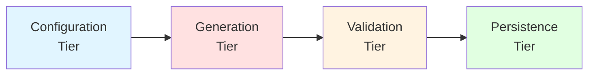
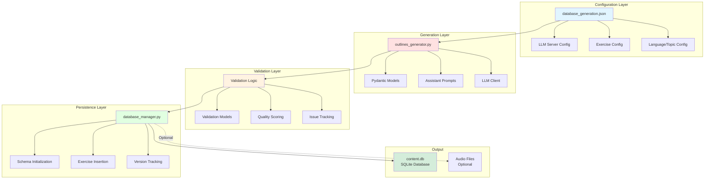

# Content Generation Architecture

## Overview

The AHLingo content generation system is an AI-powered pipeline that creates high-quality language learning exercises using Large Language Models (LLMs). This document explains the architectural decisions, design rationale, and system structure.

## What is the Content Generation System?

The content generation system is a **Python-based pipeline** that:

1. Takes configuration inputs (language, difficulty, topic, exercise type)
2. Uses LLMs with structured output to generate exercises
3. Validates generated content for quality
4. Stores validated exercises in a SQLite database
5. Optionally generates pronunciation audio

**Key Capability**: Generates ~10 lessons per language/difficulty/topic combination in about 50-60 seconds.

## Why This Architecture?

### The Problem We're Solving

Creating language learning content manually is:

- **Time-intensive**: Writing exercises takes hours per lesson
- **Expensive**: Hiring content creators at scale is costly
- **Quality-inconsistent**: Manual content varies in difficulty and structure
- **Hard to scale**: Adding languages requires finding native speakers
- **Difficult to maintain**: Updating content requires coordinating many people

### Our Solution

Use LLMs to generate exercises with:

- **Structured output**: JSON schemas enforce consistent format
- **Quality validation**: LLM-based validation catches errors before storage
- **Configurability**: JSON configuration for easy tuning
- **Repeatability**: Same inputs → similar quality outputs
- **Scalability**: Add new languages/topics via configuration

## Core Architectural Decision: Three-Tier Pipeline

The system is built as a **three-tier pipeline** rather than a monolithic generator.



### Tier 1: Configuration

**What**: JSON-based configuration defining what to generate

**Files**:
- `content/generation/config/database_generation.json`

**Responsibilities**:
- Define languages, levels, topics, exercise types
- Configure LLM servers (generation + validation)
- Set generation parameters (temperature, retries, thresholds)
- Specify exercise-type-specific settings

**Why Separate?**
- Non-developers can modify configuration without touching code
- Easy A/B testing of generation parameters
- Different environments (dev/prod) use different configs
- Configuration versioning tracks what was generated when

See `content/generation/config/database_generation.json` for the full set of configuration options.

### Tier 2: Generation

**What**: LLM-based exercise creation with structured output

**Files**:
- `content/generation/core/outlines_generator.py` (main generator)
- `content/generation/models/models.py` (Pydantic schemas)
- `content/generation/utils/assistants.py` (prompt templates)

**Responsibilities**:
- Connect to LLM server (OpenAI-compatible)
- Use Outlines library for structured JSON generation
- Generate exercises matching Pydantic schemas
- Handle retries and errors
- Apply exercise-type-specific temperatures

**Why Structured Generation?**

Traditional LLM generation produces free-form text. We need:
- **Consistency**: Same JSON structure every time
- **Validation**: Type checking at generation time
- **Reliability**: No parsing errors from malformed JSON
- **Efficiency**: No post-processing string manipulation

**Technology Choice: Outlines Library**

We use [Outlines](https://github.com/outlines-dev/outlines) because it:
- Enforces JSON schemas at token generation time
- Guarantees valid output matching Pydantic models
- Works with any OpenAI-compatible LLM
- Reduces hallucination by constraining output space

**Alternative Considered**: OpenAI Function Calling
- ✅ Pro: Native OpenAI support
- ❌ Con: Vendor lock-in
- ❌ Con: Can't use local models (Ollama, llama.cpp)
- ❌ Con: Costs more per token

### Tier 3: Validation

**What**: LLM-based quality control before database storage

**Files**:
- `content/generation/models/validation_models.py` (validation schemas)
- Validation logic in `outlines_generator.py`

**Responsibilities**:
- Check generated exercises for:
  - Correct target language
  - Proper grammar
  - Translation accuracy
  - Cultural appropriateness
  - Educational quality
  - Level-appropriate difficulty
- Score exercises 1-10 for overall quality
- Track issues found
- Reject exercises below threshold (default: 6/10)

**Why Validate with LLMs?**

**Alternative 1**: Rule-based validation
- ✅ Fast and deterministic
- ❌ Can't check semantic correctness
- ❌ Can't verify translations
- ❌ Misses cultural issues

**Alternative 2**: Human validation
- ✅ Perfect accuracy
- ❌ Slow (minutes per exercise)
- ❌ Expensive (requires bilingual reviewers)
- ❌ Doesn't scale

**Our Choice**: LLM validation
- ✅ Checks semantics and correctness
- ✅ Verifies translations
- ✅ Catches cultural issues
- ✅ Scales with generation
- ⚠️ Not perfect (can miss edge cases)
- ⚠️ Adds generation time (~30% slower)

**Trade-off**: We accept 30% slower generation for much higher quality content.

### Tier 4: Persistence

**What**: SQLite database storage with versioning

**Files**:
- `content/database/database_manager.py`
- `content/database/database_populator.py`

**Responsibilities**:
- Initialize database schema
- Insert validated exercises with unique IDs
- Group exercises into lessons (lesson_id)
- Store exercise metadata (language, topic, difficulty, type)
- Maintain referential integrity
- Track database version

**Why SQLite?**

**Alternative 1**: PostgreSQL/MySQL
- ✅ Better concurrency
- ✅ Richer query features
- ❌ Requires server setup
- ❌ Harder to distribute with mobile app
- ❌ Overkill for read-heavy workload

**Our Choice**: SQLite
- ✅ Zero-configuration
- ✅ Single file = easy distribution
- ✅ Perfect for mobile apps
- ✅ Fast enough for our use case
- ✅ Portable across platforms
- ⚠️ Limited concurrency (not an issue - generation is sequential)

## Detailed Architecture Diagram



## Key Design Patterns

### 1. Pydantic for Data Validation

All exercises use Pydantic models for:
- Type safety (enforced at runtime)
- Automatic validation
- JSON serialization/deserialization
- Clear schema documentation

**Example**:
```python
from pydantic import BaseModel
from typing import List

class ConversationTurn(BaseModel):
    speaker: str
    message: str  # alias: dialogue

class ConversationExercise(BaseModel):
    conversation: List[ConversationTurn]
    conversation_summary: str
```

**Why Pydantic?**
- Catches errors early (at model creation, not database insertion)
- Self-documenting (schema is the code)
- Works seamlessly with Outlines
- Provides excellent error messages

### 2. Template-Based Prompts

Prompts are stored as templates in `assistants.py` rather than inline:

```python
def get_assistant_prompt(exercise_type: str, language: str) -> str:
    """Return language and exercise-type specific prompt template"""
    return PROMPTS[language][exercise_type]
```

**Why Templates?**
- Easy to update without modifying code
- Language-specific customization
- Exercise-type-specific instructions
- Version control tracks prompt changes

### 3. Retry Logic with Exponential Backoff

Generation can fail (LLM errors, validation failures). We retry up to 5 times:

```python
max_retries = config.get("max_retries", 5)
for attempt in range(max_retries):
    try:
        exercise = generate_exercise(...)
        validation = validate_exercise(...)
        if validation.overall_quality_score >= threshold:
            return exercise
    except Exception as e:
        if attempt < max_retries - 1:
            time.sleep(2 ** attempt)  # exponential backoff
        else:
            raise
```

**Why Retry?**
- LLM APIs can be flaky (timeouts, rate limits)
- Validation can randomly fail (LLM outputs are stochastic)
- Exponential backoff avoids hammering server
- Tracks failures for debugging

### 4. Lesson Grouping

Exercises are grouped into lessons via `lesson_id`:

```sql
INSERT INTO exercises_info (lesson_id, language_id, topic_id, difficulty_id, type)
VALUES (1, 'French', 'Greetings', 'beginner', 'conversation')
```

**Why Lesson Grouping?**
- Mobile app fetches exercises by lesson
- Ensures variety (1 lesson = 4 exercise types)
- Simplifies progress tracking
- Enables "Study Topic" mode

## Module Organization

```
content/
├── generate_content.py          # Main entry point (consolidated script)
├── generation/
│   ├── core/
│   │   ├── outlines_generator.py   # LLM generation with Outlines
│   │   └── audio_generator.py      # TTS audio generation
│   ├── models/
│   │   ├── models.py               # Pydantic exercise models
│   │   └── validation_models.py    # Pydantic validation models
│   ├── utils/
│   │   ├── assistants.py           # Prompt templates
│   │   ├── exercise_converters.py  # Model conversion utilities
│   │   └── database_validator.py   # Post-generation validation
│   └── config/
│       └── database_generation.json # Configuration file
├── database/
│   ├── database_manager.py      # Database operations
│   └── database_populator.py    # Database population utilities
└── tests/
    └── test_generation_integration.py  # Integration tests
```

## Entry Points for Code Exploration

When exploring the codebase, start here:

### 1. Main Entry Point
**File**: `content/generate_content.py` (800+ lines)

**What**: Consolidated generation script with integrated validation

**Start Reading At**:
- Line ~50: Configuration loading
- Line ~150: LLM client setup
- Line ~300: Main generation loop
- Line ~500: Database insertion

### 2. Core Generator
**File**: `content/generation/core/outlines_generator.py` (500+ lines)

**What**: LLM-based exercise generation with Outlines

**Start Reading At**:
- `generate_exercise()` - Main generation function
- `generate_conversation_exercise()` - Conversation generation
- `validate_exercise()` - LLM-based validation

### 3. Data Models
**File**: `content/generation/models/models.py`

**What**: Pydantic schemas for all exercise types

**Start Reading At**:
- `ConversationExercise` - Most complex model
- `FillInBlankExercise` - Validation constraints

### 4. Database Manager
**File**: `content/database/database_manager.py`

**What**: SQLite operations and schema management

**Start Reading At**:
- `initialize_database()` - Schema creation
- `insert_exercise()` - Exercise storage

See `content/database/database_manager.py` for detailed function signatures.

## Performance Characteristics

### Generation Speed

**Typical Performance** (MacBook Pro M1, Ollama with llama model):
- Conversations: ~15-20 seconds each
- Pairs: ~10-15 seconds each
- Translations: ~10-15 seconds each
- Fill-in-blank: ~15-20 seconds each

**Total per combination**: ~50-60 seconds for 4 exercises

### Validation Overhead

- Adds ~30% to total generation time
- Worth it: Validation catches ~15% of exercises with issues
- Without validation: Mobile app would display broken content

### Bottlenecks

1. **LLM inference**: 80% of time (unavoidable)
2. **Validation**: 15% of time (necessary)
3. **Database insertion**: 3% of time (negligible)
4. **Audio generation**: 2% of time (optional)

**Optimization Strategy**: Parallelize generation across topics/languages (run multiple instances).

## Common Patterns

### Pattern 1: Configuration-Driven Generation

```python
# Read config
config = load_config("database_generation.json")

# Iterate over all combinations
for language in config["languages"]:
    for level in config["levels"]:
        for topic in config["topics"]:
            for exercise_type in config["exercise_types"]:
                generate_exercise(language, level, topic, exercise_type)
```

**When to Use**: Adding new languages/topics (just update config)

### Pattern 2: Structured Generation with Outlines

```python
from outlines import generate

# Define schema
schema = ConversationExercise.model_json_schema()

# Generate with schema enforcement
generator = generate.json(llm_client, schema)
exercise = generator(prompt)  # Guaranteed valid JSON
```

**When to Use**: Any new exercise type (define Pydantic model, get structured output)

### Pattern 3: LLM-Based Validation

```python
# Generate exercise
exercise = generate_exercise(...)

# Validate with separate LLM call
validation_prompt = convert_to_validation_text(exercise)
validation = validate_exercise(exercise, validation_prompt)

# Only store if quality meets threshold
if validation.overall_quality_score >= 6:
    insert_exercise(exercise)
else:
    retry()
```

**When to Use**: Any generated content (always validate before storage)

## Trade-offs and Alternatives

### Trade-off 1: Generation Speed vs. Quality

**Current Choice**: Slower generation (60s) with high quality

**Alternative**: Skip validation, generate in 40s with lower quality

**Decision**: Quality matters more than speed. Users expect correct content.

### Trade-off 2: Local Models vs. OpenAI API

**Current Choice**: Support both (OpenAI-compatible endpoints)

**OpenAI API**:
- ✅ Higher quality (GPT-4)
- ✅ No local setup
- ❌ Costs $0.01-0.03 per exercise
- ❌ Requires internet

**Local Models (Ollama)**:
- ✅ Free (after hardware cost)
- ✅ Offline capable
- ✅ Data privacy
- ❌ Lower quality (llama models)
- ❌ Requires powerful hardware

**Decision**: Support both, default to local for development, OpenAI for production.

### Trade-off 3: Structured vs. Free-Form Output

**Current Choice**: Structured (Outlines + Pydantic)

**Alternative**: Free-form text with regex/parsing

**Structured**:
- ✅ Guaranteed valid JSON
- ✅ Type safety
- ✅ No parsing errors
- ❌ Requires Outlines library
- ❌ Slightly slower (constrained generation)

**Free-Form**:
- ✅ Works with any LLM
- ✅ Slightly faster
- ❌ Parsing errors common
- ❌ No guarantees on format

**Decision**: Structured output is worth the complexity. Parsing errors break everything.

## Extending the Architecture

### Adding a New Exercise Type

1. **Define Pydantic Model** (`models.py`):
   ```python
   class NewExerciseType(BaseModel):
       field1: str
       field2: int
   ```

2. **Create Validation Model** (`validation_models.py`):
   ```python
   class NewExerciseValidation(ValidationResult):
       # Add exercise-specific validation fields
       pass
   ```

3. **Add Prompt Template** (`assistants.py`):
   ```python
   PROMPTS["English"]["new_type"] = "Generate a new type exercise..."
   ```

4. **Implement Generator** (`outlines_generator.py`):
   ```python
   def generate_new_exercise(...) -> NewExerciseType:
       schema = NewExerciseType.model_json_schema()
       generator = generate.json(llm, schema)
       return generator(prompt)
   ```

5. **Update Database Schema** (`database_manager.py`):
   ```sql
   CREATE TABLE new_exercise_type (
       id INTEGER PRIMARY KEY,
       exercise_id INTEGER,
       field1 TEXT,
       field2 INTEGER,
       FOREIGN KEY (exercise_id) REFERENCES exercises_info(id)
   );
   ```

6. **Add to Configuration** (`database_generation.json`):
   ```json
   {
       "exercise_types": ["conversations", "pairs", "translations", "fill_in_blank", "new_type"]
   }
   ```

See the "Adding a New Exercise Type" steps above for detailed instructions.

### Adding a New Language

Much simpler:

1. Add language to config:
   ```json
   {
       "languages": ["French", "Spanish", "NewLanguage"]
   }
   ```

2. Add prompt templates in `assistants.py`

3. Run generation!

No code changes needed.

## See Also

- [Core Concepts](core-concepts.md) - Exercise types and generation pipeline

---

**Next Steps**:
- Understand [Core Concepts](core-concepts.md) (exercise types, pipeline flow)
- Set up your environment and run `python content/generate_content.py` (see AGENTS.md for CLI options)
