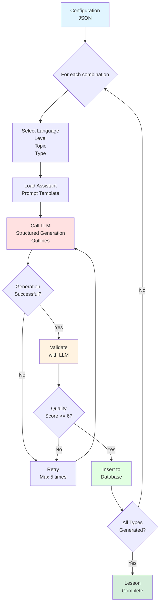
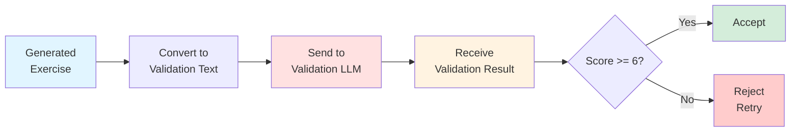

# Core Concepts

## Overview

This document explains the fundamental concepts of the AHLingo content generation system. Understanding these concepts is essential for working with the codebase.

## What Gets Generated?

The system generates **language learning exercises** in four types:

1. **Conversations** - Dialogue exchanges between speakers
2. **Word Pairs** - English ↔ Target language vocabulary matching
3. **Translations** - Full sentence translations
4. **Fill-in-the-Blank** - Cloze exercises with multiple choice

Each type serves a different learning purpose and has unique characteristics.

## The Four Exercise Types

### 1. Conversations

**What**: Realistic dialogues between 2+ speakers with a summary.

**Purpose**: Practice reading comprehension and natural language flow.

**Structure**:
```json
{
  "conversation": [
    {"speaker": "Marie", "message": "Bonjour! Comment allez-vous?"},
    {"speaker": "Jean", "message": "Très bien, merci! Et vous?"},
    {"speaker": "Marie", "message": "Je vais bien aussi."}
  ],
  "conversation_summary": "Marie and Jean greet each other and ask how they are doing."
}
```

**Generation Constraints**:
- 2-8 conversation turns (configurable)
- Culturally appropriate speaker names for target language
- Natural dialogue flow (not robotic Q&A)
- Topic-relevant content
- Level-appropriate vocabulary

**Why This Structure?**

- **Speaker names**: Provide cultural context (French → Marie/Jean, not Bob/Alice)
- **Summary**: Helps learners verify comprehension
- **Turn order**: Enables proper display in mobile app
- **Message field**: Aliased as "dialogue" for backward compatibility

**Database Storage**:
```sql
-- One row per conversation turn
CREATE TABLE conversation_exercises (
    id INTEGER PRIMARY KEY,
    exercise_id INTEGER,
    speaker TEXT,
    message TEXT,
    turn_order INTEGER,
    FOREIGN KEY (exercise_id) REFERENCES exercises_info(id)
);

-- One row per conversation
CREATE TABLE conversation_summaries (
    id INTEGER PRIMARY KEY,
    exercise_id INTEGER,
    summary TEXT,
    FOREIGN KEY (exercise_id) REFERENCES exercises_info(id)
);
```

**Validation Checks**:
- ✅ Natural dialogue flow (`has_natural_dialogue`)
- ✅ Appropriate for level (`appropriate_for_level`)
- ✅ Correct target language
- ✅ Proper grammar
- ✅ Cultural appropriateness

**Example Use Cases**:
- Beginner: Simple greetings
- Intermediate: Restaurant ordering
- Advanced: Philosophical discussions

### 2. Word Pairs (Matching Game)

**What**: English word/phrase ↔ Target language word/phrase.

**Purpose**: Vocabulary building through matching.

**Structure**:
```json
[
  {"english": "Hello", "target": "Bonjour"},
  {"english": "Goodbye", "target": "Au revoir"},
  {"english": "Thank you", "target": "Merci"},
  {"english": "Please", "target": "S'il vous plaît"}
]
```

**Generation Constraints**:
- 4-10 pairs per exercise (typically 6-8)
- Single words or short phrases (not full sentences)
- Topic-relevant vocabulary
- Level-appropriate complexity
- No duplicates within same exercise

**Why This Structure?**

- **Simple pairs**: Easy for matching game UI
- **Short content**: Fits in mobile buttons
- **Topic-focused**: All pairs relate to same topic
- **Level-appropriate**: Complexity increases with level

**Database Storage**:
```sql
CREATE TABLE pair_exercises (
    id INTEGER PRIMARY KEY,
    exercise_id INTEGER,
    english TEXT,
    target TEXT,
    FOREIGN KEY (exercise_id) REFERENCES exercises_info(id)
);
```

**Validation Checks**:
- ✅ Translation pairs correct (`translation_pairs_correct`)
- ✅ Appropriate vocabulary level (`appropriate_vocabulary_level`)
- ✅ No duplicates
- ✅ Topic-relevant

**Mobile App Usage**:
- Displayed as matching game (two columns)
- User selects pairs to match
- Correct matches turn green
- Incorrect matches shake and turn red

**Example Progression**:

**Beginner** (Greetings):
- Hello → Bonjour
- Goodbye → Au revoir

**Intermediate** (Food):
- The restaurant → Le restaurant
- I would like → Je voudrais

**Advanced** (Video Games):
- The multiplayer mode → Le mode multijoueur
- The achievement → Le succès

### 3. Translations

**What**: Full sentence translations (English ↔ Target language).

**Purpose**: Practice translating complete thoughts.

**Structure**:
```json
{
  "english": "I would like to order a coffee, please.",
  "target": "Je voudrais commander un café, s'il vous plaît."
}
```

**Generation Constraints**:
- Complete sentences (not fragments)
- Grammatically correct in both languages
- Meaning preserved exactly
- Natural phrasing (not word-for-word literal)
- Level-appropriate grammar structures

**Why This Structure?**

- **Full sentences**: Practice real-world communication
- **Bidirectional**: Can test both directions
- **Natural language**: Teaches idiomatic expressions
- **Grammar showcase**: Demonstrates proper sentence structure

**Database Storage**:
```sql
CREATE TABLE translation_exercises (
    id INTEGER PRIMARY KEY,
    exercise_id INTEGER,
    english TEXT,
    target TEXT,
    FOREIGN KEY (exercise_id) REFERENCES exercises_info(id)
);
```

**Validation Checks**:
- ✅ Translation accurate (`is_translation_accurate`)
- ✅ Meaning preserved (`preserves_meaning`)
- ✅ Natural language used (`uses_natural_language`)
- ✅ Proper grammar
- ✅ Level-appropriate structures

**Grammar Structures by Level**:

**Beginner**:
- Present tense simple sentences
- Basic subject-verb-object
- Common phrases

**Intermediate**:
- Multiple tenses (past, future)
- Compound sentences
- Conditional structures

**Advanced**:
- Subjunctive mood
- Complex clauses
- Idiomatic expressions

**Example Progression**:

**Beginner**:
- English: "I am happy."
- French: "Je suis heureux."

**Intermediate**:
- English: "If I had time, I would travel to Paris."
- French: "Si j'avais le temps, je voyagerais à Paris."

**Advanced**:
- English: "It is essential that you understand the subjunctive mood."
- French: "Il est essentiel que vous compreniez le subjonctif."

### 4. Fill-in-the-Blank (Cloze)

**What**: Sentence with one blank, three answer choices (1 correct, 2 incorrect).

**Purpose**: Test grammar, vocabulary, and context understanding.

**Structure**:
```json
{
  "sentence": "Je _ à l'école tous les jours.",
  "correct_answer": "vais",
  "incorrect_1": "va",
  "incorrect_2": "allons",
  "blank_position": 1,
  "translation": "I go to school every day."
}
```

**Generation Constraints**:
- **Exactly one blank** per sentence (enforced by validation)
- Blank represented by underscore "_"
- Three unique answer choices
- Incorrect answers plausible but clearly wrong
- Blank position tracked (word index)
- Complete English translation provided (no blanks)
- **Must be unambiguous** (only one correct answer)

**Why This Structure?**

- **One blank**: Focuses on specific knowledge point
- **Three choices**: Standard multiple choice (not too hard/easy)
- **Plausible distractors**: Tests true understanding
- **Translation**: Provides context clues
- **Blank position**: Enables UI cursor placement

**Database Storage**:
```sql
CREATE TABLE fill_in_blank_exercises (
    id INTEGER PRIMARY KEY,
    exercise_id INTEGER,
    sentence TEXT,           -- Contains "_" for blank
    correct_answer TEXT,
    incorrect_1 TEXT,
    incorrect_2 TEXT,
    blank_position INTEGER,  -- Word index (0-based)
    translation TEXT,        -- Complete English sentence
    FOREIGN KEY (exercise_id) REFERENCES exercises_info(id)
);
```

**Validation Checks**:
- ✅ Exactly one blank in sentence
- ✅ Translation has no blanks (`translation_has_no_blanks`)
- ✅ Translation matches original (`translation_matches_original`)
- ✅ Answer options appropriate (`answer_options_appropriate`)
- ✅ **Unambiguous** (`is_unambiguous`) - Critical validation
- ✅ All three answers unique

**Unambiguous Validation**:

This is the most important validation for fill-in-blank exercises. The LLM validator checks:
- Only correct answer grammatically fits
- Incorrect answers clearly wrong in context
- No alternative valid answers possible

**Example of Ambiguous (REJECTED)**:
```
Sentence: "Je _ un livre."
Correct: "lis"
Incorrect: "mange", "danse"

Problem: Could also be "vois" (see), "cherche" (look for), "veux" (want), etc.
Status: ❌ REJECTED - Ambiguous
```

**Example of Unambiguous (ACCEPTED)**:
```
Sentence: "Je _ à l'école tous les jours."
Correct: "vais"
Incorrect: "va", "allons"

Analysis:
- "vais" = correct (1st person singular, aller)
- "va" = 3rd person (wrong subject)
- "allons" = 1st person plural (wrong subject)
- No other valid options

Status: ✅ ACCEPTED - Unambiguous
```

**Configuration Option**:
```json
{
  "generation_settings": {
    "require_unambiguous_fill_in_blank": true
  }
}
```

**Mobile App Usage**:
- Display sentence with blank highlighted
- Show three answer buttons
- User taps correct answer
- Instant feedback (green/red)

**Example Progression**:

**Beginner** (Simple verb conjugation):
- "Je _ français." → parle/parles/parlons
- Tests: Subject-verb agreement

**Intermediate** (Prepositions):
- "Je vais _ Paris." → à/de/dans
- Tests: Preposition usage

**Advanced** (Subjunctive):
- "Il faut que je _ ce livre." → lise/lis/lit
- Tests: Subjunctive vs. indicative

## The Content Generation Pipeline

Understanding how exercises flow through the system is crucial.



### Pipeline Stages Explained

**Stage 1: Configuration Loading**
- Read `database_generation.json`
- Extract: languages, levels, topics, exercise types
- Initialize LLM clients (generation + validation)

**Stage 2: Combination Selection**
- Iterate through all combinations
- Example: French × Beginner × Greetings × Conversation

**Stage 3: Prompt Template Loading**
- Select language-specific template
- Select exercise-type-specific instructions
- Combine into final prompt

**Stage 4: LLM Generation with Outlines**
- Send prompt to LLM
- Enforce Pydantic schema (structured JSON)
- Parse response into Pydantic model
- Handle errors (retry if needed)

**Stage 5: LLM Validation**
- Convert exercise to validation text
- Send to validation LLM with rubric
- Parse validation response (1-10 score + checks)
- Compare score to threshold (default: 6)

**Stage 6: Database Insertion**
- Insert exercise metadata into `exercises_info`
- Insert exercise data into type-specific table
- Link via `exercise_id` foreign key
- Group exercises by `lesson_id`

**Stage 7: Lesson Completion**
- Check if all 4 types generated for combination
- Mark lesson as complete
- Move to next combination

### Configuration-Driven Flow

The entire pipeline is driven by configuration:

```json
{
  "languages": ["French", "Spanish", "German"],
  "levels": ["beginner", "intermediate", "advanced"],
  "topics": ["Greetings", "Food", "Travel"],
  "exercise_types": ["conversations", "pairs", "translations", "fill_in_blank"],
  "generation_settings": {
    "lessons_per_combination": 10
  }
}
```

**Total exercises generated**:
- 3 languages × 3 levels × 3 topics × 10 lessons × 4 types = **1,080 exercises**

**Generation time**:
- ~60 seconds per combination
- 3 × 3 × 3 × 10 = 270 combinations
- Total: ~4.5 hours (can parallelize)

## Lesson Grouping Concept

Exercises are grouped into **lessons** for structured learning.

### What is a Lesson?

A lesson is a **collection of 4 exercises** (one of each type) for the same:
- Language
- Level
- Topic

**Example Lesson**: French × Beginner × Greetings
1. Conversation exercise (dialogue)
2. Pair exercise (matching)
3. Translation exercise (sentence)
4. Fill-in-blank exercise (cloze)

### Why Lesson Grouping?

**Benefits**:
- ✅ Ensures variety (practice all skill types)
- ✅ Structured learning progression
- ✅ Easy progress tracking (% of lessons completed)
- ✅ Enables "Study Topic" mode in mobile app

**Database Implementation**:
```sql
-- Same lesson_id for all 4 exercises
INSERT INTO exercises_info (lesson_id, language_id, topic_id, difficulty_id, type)
VALUES
  (1, 'French', 'Greetings', 'beginner', 'conversation'),
  (1, 'French', 'Greetings', 'beginner', 'pairs'),
  (1, 'French', 'Greetings', 'beginner', 'translation'),
  (1, 'French', 'Greetings', 'beginner', 'fill_in_blank');
```

**Mobile App Usage**:
```typescript
// Fetch all exercises for a lesson
SELECT * FROM content.exercises_info
WHERE lesson_id = ?;

// Results: 4 exercises (1 of each type)
```

### Lessons vs. Individual Exercises

**Study Modes**:

**"Study Topic" Mode**:
- Fetches complete lessons (4 exercises)
- User completes all 4 types in sequence
- Tracks lesson completion

**"Exercise Shuffle" Mode**:
- Fetches individual exercises (any type)
- Randomizes across topics
- Variety challenge mode

**"Pairs Game" Mode**:
- Fetches only pair exercises
- Topic-specific
- Practice vocabulary

## Structured Generation with Outlines

### What is Outlines?

[Outlines](https://github.com/outlines-dev/outlines) is a library that **enforces JSON schemas during LLM generation**.

**Traditional LLM Generation**:
```python
response = llm.generate("Generate a conversation in French")
# Response: Free-form text (might not be valid JSON)
# Need to parse, validate, handle errors
```

**Structured Generation with Outlines**:
```python
from outlines import generate

schema = ConversationExercise.model_json_schema()
generator = generate.json(llm_client, schema)
response = generator(prompt)
# Response: GUARANTEED valid JSON matching schema
# No parsing errors possible
```

### How Outlines Works

Outlines constrains token generation at each step:

1. **Schema Analysis**: Parse Pydantic model into JSON schema
2. **Token Constraints**: At each generation step, only allow tokens that keep JSON valid
3. **Grammar Enforcement**: Enforce JSON grammar rules (brackets, commas, quotes)
4. **Type Validation**: Ensure values match expected types (string, int, list, etc.)

**Example**: Generating conversation turn

```python
class ConversationTurn(BaseModel):
    speaker: str
    message: str
```

**Constrained Generation**:
- After `{"speaker": "`, only allow string characters (no numbers, brackets)
- After `"speaker": "Marie"`, only allow comma (not bracket, quote)
- After `"message": "`, only allow string characters
- Enforce closing brackets and quotes

**Result**: ALWAYS valid JSON, no parsing needed.

### Why This Matters

**Problem without Outlines**:
- LLMs hallucinate invalid JSON (~5-10% failure rate)
- Need to parse and handle errors
- Retry logic complex
- Wastes LLM calls on invalid output

**Solution with Outlines**:
- 0% JSON parsing errors
- Guaranteed schema compliance
- Simpler error handling
- More reliable generation

**Trade-off**: Slightly slower generation (constrained decoding overhead), but worth it for reliability.

## Validation Concept

### Why Validate?

LLMs can generate:
- ❌ Wrong language (French exercise with English words)
- ❌ Poor grammar
- ❌ Inaccurate translations
- ❌ Culturally inappropriate content
- ❌ Wrong difficulty level

**Solution**: Validate every exercise before storage.

### Validation Process



### Validation Models

Each exercise type has specific validation criteria:

**Base Validation** (all types):
```python
class ValidationResult(BaseModel):
    is_correct_language: bool
    has_correct_grammar: bool
    is_translation_accurate: bool
    is_culturally_appropriate: bool
    is_educational_quality: bool
    overall_quality_score: int  # 1-10
    issues_found: List[str]
```

**Exercise-Specific** (extends base):

**Conversations**:
- `has_natural_dialogue`: Not robotic Q&A
- `appropriate_for_level`: Vocabulary matches level

**Pairs**:
- `translation_pairs_correct`: All pairs accurate
- `appropriate_vocabulary_level`: Words match level

**Translations**:
- `preserves_meaning`: Meaning unchanged
- `uses_natural_language`: Idiomatic expressions

**Fill-in-Blank**:
- `translation_matches_original`: Translation complete and accurate
- `translation_has_no_blanks`: English has no "_"
- `answer_options_appropriate`: Incorrect answers plausible
- `is_unambiguous`: Only one valid answer

### Quality Scoring (1-10)

The validation LLM assigns an overall quality score:

- **9-10**: Excellent, publication-ready
- **7-8**: Good, minor issues
- **6**: Acceptable, meets minimum bar
- **4-5**: Poor, needs revision
- **1-3**: Unacceptable, fundamental issues

**Default Threshold**: 6 (configurable)

**Configuration**:
```json
{
  "generation_settings": {
    "validation_threshold": 6
  }
}
```

### Validation vs. Generation LLMs

**Separate LLMs** (recommended):

```json
{
  "llm_servers": {
    "generation": {
      "model": "llama",
      "temperature": 0.75
    },
    "validation": {
      "model": "llama",
      "temperature": 0.3
    }
  }
}
```

**Why Different Temperatures?**

**Generation** (0.75):
- Higher creativity
- Varied outputs
- Natural language

**Validation** (0.3):
- More consistent
- Stricter evaluation
- Less variation

**Can use same or different models** (flexible configuration).

## Common Patterns

### Pattern 1: Exercise Type Selection

```python
def generate_exercise(exercise_type, language, topic, difficulty, config):
    if exercise_type == "conversations":
        return generate_conversation_exercise(...)
    elif exercise_type == "pairs":
        return generate_pair_exercise(...)
    elif exercise_type == "translations":
        return generate_translation_exercise(...)
    elif exercise_type == "fill_in_blank":
        return generate_fill_in_blank_exercise(...)
```

**When to Use**: Main generation loop

### Pattern 2: Pydantic Model Usage

```python
# Define model
class ConversationExercise(BaseModel):
    conversation: List[ConversationTurn]
    conversation_summary: str

# Use with Outlines
schema = ConversationExercise.model_json_schema()
generator = generate.json(llm, schema)
exercise = generator(prompt)

# Guaranteed to be ConversationExercise instance
assert isinstance(exercise, ConversationExercise)
```

**When to Use**: All exercise generation

### Pattern 3: Validation with Retry

```python
max_retries = 5
for attempt in range(max_retries):
    exercise = generate_exercise(...)
    validation = validate_exercise(...)

    if validation.overall_quality_score >= threshold:
        return exercise

    print(f"Attempt {attempt + 1} failed: {validation.issues_found}")

raise Exception("Failed to generate valid exercise")
```

**When to Use**: Production generation (always validate)

## See Also

- [Architecture](architecture.md) - Why the system is designed this way

---

**Next Steps**:
- Understand the [Architecture](architecture.md) (design decisions)
- Tune generation via `content/generation/config/database_generation.json`
- Start generating content with `python content/generate_content.py`
