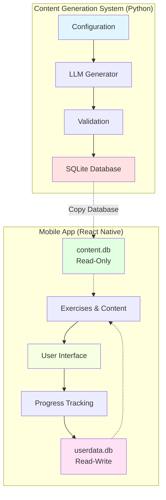

# AHLingo Documentation

Welcome to the comprehensive documentation for **AHLingo**, an AI-powered language learning platform consisting of a content generation system and a mobile application.

## What is AHLingo?

AHLingo is a complete language learning ecosystem with two main components that work together:

1. **Content Generation System** (Python): An LLM-powered system that generates high-quality language learning exercises
2. **Mobile Application** (React Native): A cross-platform mobile app that delivers interactive language learning experiences

## System Overview

## Why This Documentation Exists

This documentation is designed to help:

- **Junior Developers**: Understand the architecture and start contributing quickly
- **Senior Developers**: Make informed decisions about system changes and extensions
- **LLMs**: Have sufficient context to assist with code modifications and feature additions
- **New Team Members**: Onboard efficiently with clear architectural rationale

## Key Architectural Decisions

Understanding WHY things are built the way they are is critical. Here are the core architectural decisions:

### Content Generation System

**Decision**: Three-tier pipeline (Configuration → Generation → Validation → Persistence)

**Rationale**: Separating concerns allows for:
- Independent tuning of generation vs. validation
- Quality control at every stage
- Easy addition of new exercise types
- Reusable validation logic

**Trade-off**: Slightly slower generation (validation adds time) but much higher quality content.

[Learn more about Generation Architecture →](generation/architecture.md)

### Mobile Application

**Decision**: Two-database architecture (content.db + userdata.db)

**Rationale**: Separating content from user data enables:
- Safe content updates without risking user progress
- Complete database replacement for content updates
- Independent schema migrations for user data
- Simpler backup/restore strategies

**Trade-off**: Slightly more complex database initialization, but massive benefits for content deployment.

[Learn more about Mobile Architecture →](mobile/architecture.md)

**Decision**: Redux + Context hybrid state management

**Rationale**:
- Redux for global app state (settings, game state) that needs time-travel debugging
- Context for UI state (theme) that changes frequently and doesn't need history
- Best of both worlds without over-engineering

[Learn more about State Management →](mobile/state-management.md)

## Component Relationships

### Content Flow

1. **Generation System** creates exercises using LLMs with structured output (Outlines library)
2. **Validation System** checks quality using LLM-based rubrics (1-10 scoring)
3. **Database Export** produces `content.db` with all exercises
4. **Mobile App** bundles `content.db` and attaches it to `userdata.db` at runtime
5. **User Progress** is stored separately in `userdata.db` and never affected by content updates

[Learn more about Content Pipeline →](integration/content-pipeline.md)

### Version Management

All components share a single version source: `ahlingo_mobile/package.json`

- **Database version**: Calculated as `major * 100 + minor * 10 + patch`
- **Content version**: Stored in `content.database_metadata` table
- **User schema version**: Stored in `userdata.schema_version` table
- **Compatibility checks**: Performed at app startup

[Learn more about Versioning →](integration/versioning.md)

## Technology Stack

### Content Generation
- **Language**: Python 3.8+
- **LLM Integration**: OpenAI API + Outlines (structured generation)
- **Data Validation**: Pydantic
- **Database**: SQLite
- **Audio Generation**: TTS (XTTS-v2), Ukrainian-TTS
- **Configuration**: JSON-based

[Explore Content Generation →](generation/index.md)

### Mobile Application
- **Framework**: React Native 0.80.0
- **Language**: TypeScript
- **State Management**: Redux Toolkit 2.8.2 + Context API
- **Navigation**: React Navigation 7.x
- **Database**: SQLite (react-native-sqlite-storage)
- **AI Integration**: OpenAI API + llama.rn (local LLM)
- **Testing**: Jest + React Native Testing Library + Detox

[Explore Mobile App →](mobile/index.md)

## Quick Navigation

### For New Developers

Start here to understand the codebase:

1. [Content Generation Architecture](generation/architecture.md) - WHY the generation system is designed this way
2. [Mobile App Architecture](mobile/architecture.md) - WHY we use two databases and Redux+Context
3. [Content Pipeline](integration/content-pipeline.md) - How content flows from generation to mobile
4. [Critical Files Reference](generation/developer-guide.md#critical-files) - Entry points for code exploration

### For Content Generation Work

1. [Getting Started](generation/getting-started.md) - Setup and first run
2. [Core Concepts](generation/core-concepts.md) - Exercise types and pipeline
3. [Configuration Guide](generation/configuration.md) - Config file reference
4. [Developer Guide](generation/developer-guide.md) - Adding features and languages

### For Mobile App Work

1. [Developer Setup](mobile/getting-started-dev.md) - Environment setup
2. [Database Architecture](mobile/database.md) - Two-database pattern explained
3. [Services](mobile/services.md) - Service layer and business logic
4. [Components](mobile/components.md) - Reusable UI components
5. [Testing](mobile/testing.md) - Testing strategy and examples

### For Integration & Deployment

1. [Content Pipeline](integration/content-pipeline.md) - Deploying content updates
2. [Versioning Strategy](integration/versioning.md) - Version management
3. [Content Generation Ops](operations/content-generation-ops.md) - Production workflows
4. [Mobile Deployment](operations/mobile-deployment.md) - App store deployment

## Documentation Philosophy

This documentation follows these principles:

1. **Context-First**: We explain WHY before diving into HOW
2. **Decision Rationale**: Every major architectural decision is explained
3. **Entry Points**: Clear starting points for code exploration
4. **Pattern Documentation**: Common patterns documented with usage guidance
5. **Explicit over Implicit**: We don't assume background knowledge

## Getting Help

- **Search**: Use the search feature (top of page) to find specific topics
- **Cross-References**: Follow links to related documentation sections
- **Code Examples**: All examples are runnable and tested
- **Diagrams**: Visual representations for complex systems

## Next Steps

- **New to the project?** Start with [Content Generation Architecture](generation/architecture.md) and [Mobile Architecture](mobile/architecture.md)
- **Setting up development?** Go to [Generation Getting Started](generation/getting-started.md) or [Mobile Developer Setup](mobile/getting-started-dev.md)
- **Want to understand a specific feature?** Use the navigation above or search

---

**Documentation Version**: 1.6.0
**Last Updated**: January 2026
**Status**: Active Development
