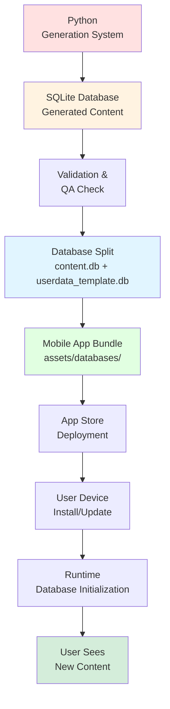

# Content Pipeline: Generation to Mobile

## Overview

This document explains how content flows from the generation system to the mobile app - one of the most critical integration points in the AHLingo platform.

## What is the Content Pipeline?

The content pipeline is the **end-to-end workflow** for getting AI-generated exercises into users' hands:



## Why This Pipeline?

### The Problem: Content Distribution

Getting content from developers to users involves several challenges:

**Challenge 1: Format Compatibility**
- Generation system uses SQLite
- Mobile app uses SQLite
- But schemas must match exactly

**Challenge 2: Safe Updates**
- Can't risk user data loss
- Must handle version mismatches
- Need rollback capability

**Challenge 3: Distribution**
- App store approval takes time
- Users don't update immediately
- Need backwards compatibility

**Challenge 4: Quality Assurance**
- Generated content needs review
- Errors must be caught before distribution
- Validation is critical

### Our Solution: Two-Database Architecture + Versioning

The content pipeline leverages the two-database architecture:

**Key Insight**: Content and user data are completely separated, allowing safe content replacement without affecting user progress.

[See Database Architecture →](../mobile/database.md)

## Pipeline Stages

### Stage 1: Content Generation

**Location**: Python generation system

**Input**: Configuration (languages, levels, topics)

**Process**:
```bash
cd scripts
python generate_content.py \
  --language French \
  --level beginner \
  --topic Greetings \
  --limit 10
```

**Output**: SQLite database with exercises

**Time**: ~50-60 seconds per language/level/topic combination

**Key Files**:
- `content/generate_content.py` - Main generation script
- `content/generation/core/exercise_generator.py` - LLM generation
- `content/generation/core/llm_client.py` - OpenAI-compatible tool-calling client
- `content/database/database_manager.py` - Database creation

[Learn about Generation System →](../generation/architecture.md)

### Stage 2: Validation & QA

**Purpose**: Ensure content quality before distribution

**Automated Validation** (during generation):
- LLM-based validation (1-10 scoring)
- Grammar checking
- Translation accuracy
- Cultural appropriateness
- Level-appropriate difficulty

**Manual QA** (recommended for production):
```bash
# Run validation script
python scripts/validate_content.py \
  --database output.db \
  --report validation_report.html
```

**Validation Checks**:
- ✅ All exercise types present
- ✅ No duplicate content
- ✅ Audio files generated (if enabled)
- ✅ Database integrity (foreign keys, indexes)
- ✅ Version metadata correct

**Output**: Validation report + approved database

### Stage 3: Database Preparation

**Purpose**: Split monolithic database into content + userdata

**Script**: `ahlingo_mobile/scripts/splitDatabase.js`

**Usage**:
```bash
cd ahlingo_mobile
node scripts/splitDatabase.js
```

**Process**:
1. Read `assets/databases/languageLearningDatabase.db` (source)
2. Extract content tables → `content.db`
3. Extract user tables → `userdata_template.db`
4. Add `schema_version` table to userdata
5. Add `database_metadata` table to content
6. Create backups of existing files

**Output**:
- `content.db` (~5.9 MB) - Read-only content
- `userdata_template.db` (~36 KB) - User data template

**Why This Step?**

The mobile app requires two databases (not one monolithic database). This split enables:
- Safe content updates (replace content.db only)
- User data preservation (userdata.db never replaced)
- Independent versioning

[See Database Architecture →](../mobile/database.md)

### Stage 4: Version Management

**Purpose**: Track content version for compatibility

**Update Content Version**:
```sql
-- In content.db
UPDATE database_metadata
SET value = '161'  -- Version 1.6.1 → 161
WHERE key = 'version';
```

**Version Calculation**:
```typescript
// Formula: major * 100 + minor * 10 + patch
// Example: 1.6.1 → (1 * 100) + (6 * 10) + 1 = 161
```

**Why Version Numbers Matter**:
- App checks content version on startup
- Incompatible versions rejected
- Users warned about mismatches
- Enables gradual rollout

[See Versioning Strategy →](versioning.md)

### Stage 5: Mobile App Bundle

**Purpose**: Include databases in app package

**Asset Configuration** (`react-native.config.js`):
```javascript
module.exports = {
  project: {
    ios: {},
    android: {},
  },
  assets: ['./assets/databases'],  // Bundle database files
};
```

**Build Process**:
```bash
# iOS
npm run ios:build

# Android
npm run android:build
```

**What Gets Bundled**:
- `assets/databases/content.db` (5.9 MB)
- `assets/databases/userdata_template.db` (36 KB)

**Result**: App package (.ipa/.apk) with databases embedded

### Stage 6: App Store Deployment

**Purpose**: Distribute app to users

**iOS App Store**:
```bash
# Build for release
npm run ios:build:release

# Upload to App Store Connect
# Review process: 1-3 days typically
```

**Android Play Store**:
```bash
# Build signed APK/AAB
npm run android:build:release

# Upload to Play Console
# Review process: hours to days
```

**Key Considerations**:
- Content changes require full app update
- App store review can delay updates
- Users must manually update (usually)
- Not all users update immediately

### Stage 7: User Device Installation

**What Happens When User Installs/Updates**:

**First Install**:
```typescript
// 1. App bundle extracted
// 2. Databases copied from bundle to Documents/

await RNFS.copyFileAssets(
  'databases/content.db',
  `${DocumentsDir}/content.db`
);

await RNFS.copyFileAssets(
  'databases/userdata_template.db',
  `${DocumentsDir}/userdata.db`
);

// 3. User starts with fresh content + empty progress
```

**App Update** (existing user):
```typescript
// 1. New app installed over old app
// 2. New content.db replaces old content.db

if (bundledContentVersion > installedContentVersion) {
  // Copy new content.db from bundle
  await RNFS.copyFileAssets(
    'databases/content.db',
    `${DocumentsDir}/content.db`
  );
}

// 3. userdata.db UNTOUCHED (user progress preserved)
// 4. User schema migrations run (if needed)
// 5. App ready with new content + preserved progress
```

**Key Insight**: User data survives updates because it's in a separate database.

### Stage 8: Runtime Initialization

**What Happens on App Launch**:

```typescript
// 1. Open userdata.db (primary connection)
const db = await SQLite.openDatabase({
  name: 'userdata.db',
  location: 'default'
});

// 2. Attach content.db
await db.executeSql(
  `ATTACH DATABASE '${contentDbPath}' AS content`
);

// 3. Check versions
const contentVersion = await getContentVersion(db);
const appVersion = await getAppVersion();

if (!isCompatible(contentVersion, appVersion)) {
  showVersionMismatchWarning();
}

// 4. Run user schema migrations (if needed)
await migrateUserSchema(db);

// 5. Ready!
```

**File**: `src/utils/databaseUtils.ts`

## Version Compatibility

### Compatibility Matrix

| Content DB | App Version | Compatible? | What Happens |
|------------|-------------|-------------|--------------|
| 1.6.0 (160) | 1.6.0 | ✅ Yes | Perfect match |
| 1.6.1 (161) | 1.6.0 | ✅ Yes | Patch difference OK |
| 1.7.0 (170) | 1.6.0 | ⚠️ Warning | Minor difference, warn user |
| 2.0.0 (200) | 1.6.0 | ❌ No | Major difference, reject |

### Compatibility Rules

**Major Version Mismatch**: Incompatible
```typescript
if (contentMajor !== appMajor) {
  throw new Error('Content database incompatible with this app version');
}
```

**Minor Version Mismatch**: Compatible with warning
```typescript
if (contentMinor !== appMinor) {
  console.warn('Content version differs from app version');
  // Show user notification
}
```

**Patch Version Mismatch**: Compatible, silent
```typescript
if (contentPatch !== appPatch) {
  // No warning needed
}
```

## Content Update Workflow

### Scenario: Adding 100 New Exercises

**Step 1**: Generate content (Python)
```bash
python scripts/generate_content.py \
  --language Spanish \
  --level intermediate \
  --topic "Video Games" \
  --limit 10
```

**Step 2**: Validate content
```bash
python scripts/validate_content.py --database output.db
```

**Step 3**: Update source database
```bash
# Copy generated exercises to source database
sqlite3 assets/databases/languageLearningDatabase.db < output.sql
```

**Step 4**: Split database
```bash
cd ahlingo_mobile
node scripts/splitDatabase.js
```

**Step 5**: Bump version
```typescript
// Update package.json
{
  "version": "1.6.1"  // Was 1.6.0
}

// Run version update script
python scripts/update_database_version.py
```

**Step 6**: Build app
```bash
npm run android:build
npm run ios:build
```

**Step 7**: Deploy to app stores

**Step 8**: Users update app

**Step 9**: Users see new content!

**Total Time**: Hours to days (depending on app store review)

## Deployment Strategies

### Strategy 1: Standard App Update (Current)

**How It Works**:
- Content bundled in app
- Requires app store deployment
- Users must update app

**Pros**:
- ✅ Simple process
- ✅ No server infrastructure needed
- ✅ Works offline

**Cons**:
- ❌ Slow (app store review)
- ❌ Requires user action
- ❌ All-or-nothing (can't partial update)

### Strategy 2: Remote Content Sync (Future)

**How It Would Work**:
```typescript
// On app launch
const remoteVersion = await fetchContentVersion();
if (remoteVersion > localVersion) {
  await downloadContentDatabase(remoteVersion);
  await replaceContentDatabase();
  await restartApp();
}
```

**Pros**:
- ✅ Instant updates (no app store)
- ✅ Gradual rollout possible
- ✅ Rollback capability
- ✅ A/B testing content

**Cons**:
- ❌ Requires server infrastructure
- ❌ Network dependency
- ❌ More complex
- ❌ Download size concerns

**Status**: Not implemented (potential future enhancement)

### Strategy 3: Hybrid Approach (Future)

**How It Would Work**:
- Ship base content with app
- Download additional content on demand
- Cache downloaded content

**Use Cases**:
- User selects new language → download that language's content
- New topic released → download only that topic
- Premium content → download after purchase

**Status**: Not implemented (potential future enhancement)

## Quality Assurance

### Pre-Deployment Checklist

Before deploying content updates:

- [ ] All exercises generated successfully
- [ ] Validation passed (score >= 6)
- [ ] No duplicate exercises
- [ ] Audio files generated (if enabled)
- [ ] Database split successful
- [ ] Version number bumped
- [ ] Test on iOS device
- [ ] Test on Android device
- [ ] User data preserved after update
- [ ] No migration errors
- [ ] Performance acceptable (query times)

### Testing Content Updates

**Test Scenario 1**: Fresh Install
```bash
# 1. Build app with new content
# 2. Install on clean device
# 3. Verify:
#    - All content accessible
#    - No crashes
#    - Performance good
```

**Test Scenario 2**: Existing User Update
```bash
# 1. Install old app version
# 2. Create user, complete some exercises
# 3. Build and install new app version
# 4. Verify:
#    - User progress preserved
#    - New content accessible
#    - Old + new content coexist
#    - No crashes
```

**Test Scenario 3**: Version Mismatch
```bash
# 1. Install app with content v1.6.0
# 2. Manually replace content.db with v2.0.0
# 3. Launch app
# 4. Verify:
#    - Error message shown
#    - App doesn't crash
#    - User can't proceed
```

## Troubleshooting

### "Content database version mismatch"

**Symptoms**: Warning or error on app launch

**Cause**: content.db version doesn't match app version

**Solutions**:

**If patch/minor difference**:
- App should work (just show warning)
- Update app when convenient

**If major difference**:
- App won't work properly
- MUST update app to matching version

### "Failed to copy content database"

**Symptoms**: App crashes on first launch

**Causes**:
1. content.db not in bundle
2. Insufficient storage
3. File permissions

**Solutions**:
```bash
# 1. Verify content.db in bundle
ls -la assets/databases/content.db

# 2. Check available storage on device

# 3. Reinstall app
```

### "Exercises not showing up"

**Symptoms**: User reports missing exercises after update

**Causes**:
1. content.db didn't copy
2. Database attachment failed
3. Query using wrong version

**Debug**:
```typescript
// Check content.db exists
const exists = await RNFS.exists(`${DocumentsDir}/content.db`);
console.log('content.db exists:', exists);

// Check content version
const version = await getContentVersion(db);
console.log('Content version:', version);

// Test query
const count = await db.executeSql(`
  SELECT COUNT(*) as count FROM content.exercises_info
`);
console.log('Exercise count:', count.rows.item(0).count);
```

### "User progress lost after update"

**Symptoms**: User reports lost progress

**Cause**: Likely NOT a content update issue (userdata.db should be preserved)

**Possible Causes**:
1. App reinstalled (not updated)
2. Device reset
3. Manual database deletion
4. Bug in migration code

**Debug**:
```typescript
// Check if userdata.db exists
const exists = await RNFS.exists(`${DocumentsDir}/userdata.db`);

// Check user_exercise_attempts count
const count = await db.executeSql(`
  SELECT COUNT(*) as count FROM user_exercise_attempts
`);
console.log('Attempts count:', count.rows.item(0).count);
```

## Best Practices

### DO:

✅ **Always validate generated content** before deployment
```bash
python scripts/validate_content.py --database output.db
```

✅ **Run split script** after content changes
```bash
node scripts/splitDatabase.js
```

✅ **Bump version number** with every content update
```json
{
  "version": "1.6.1"  // Don't forget!
}
```

✅ **Test on both platforms** before deploying
```bash
npm run ios  # Test on iOS
npm run android  # Test on Android
```

✅ **Test with existing user data** (not just fresh install)

✅ **Monitor app store reviews** after content updates

### DON'T:

❌ **Don't skip validation** (bad content → bad user experience)

❌ **Don't modify content.db directly** in mobile app (edit source, then split)

❌ **Don't forget to update version metadata** in database

❌ **Don't deploy without testing** on real devices

❌ **Don't assume all users update immediately** (plan for mixed versions)

## Future Enhancements

### Remote Content Delivery

**Vision**: Update content without app store deployment

**Implementation**:
```typescript
// Content delivery service
class ContentDeliveryService {
  async checkForUpdates() {
    const remoteVersion = await api.getContentVersion();
    if (remoteVersion > this.localVersion) {
      return {available: true, version: remoteVersion};
    }
    return {available: false};
  }

  async downloadContent(version: number) {
    const url = api.getContentUrl(version);
    await RNFS.downloadFile({
      fromUrl: url,
      toFile: `${DocumentsDir}/content_${version}.db`
    });
  }

  async applyUpdate(version: number) {
    // Backup current
    await RNFS.copyFile(
      `${DocumentsDir}/content.db`,
      `${DocumentsDir}/content_backup.db`
    );

    // Replace with new version
    await RNFS.copyFile(
      `${DocumentsDir}/content_${version}.db`,
      `${DocumentsDir}/content.db`
    );

    // Verify
    const isValid = await this.verifyDatabase();
    if (!isValid) {
      // Rollback
      await RNFS.copyFile(
        `${DocumentsDir}/content_backup.db`,
        `${DocumentsDir}/content.db`
      );
      throw new Error('Update verification failed');
    }
  }
}
```

**Benefits**:
- Instant content updates
- Gradual rollout
- A/B testing
- Quick rollback

**Challenges**:
- Server infrastructure
- Network reliability
- Storage management
- Security (verify downloads)

### Delta Updates

**Vision**: Download only changed content (not entire database)

**Implementation**:
```typescript
// Instead of downloading full 5.9 MB database,
// download only new/modified exercises (~100 KB)

interface ContentDelta {
  added_exercises: Exercise[];
  modified_exercises: Exercise[];
  deleted_exercise_ids: number[];
}

async applyDelta(delta: ContentDelta) {
  await db.transaction(async (tx) => {
    // Insert new exercises
    for (const exercise of delta.added_exercises) {
      await insertExercise(tx, exercise);
    }

    // Update modified exercises
    for (const exercise of delta.modified_exercises) {
      await updateExercise(tx, exercise);
    }

    // Delete removed exercises
    for (const id of delta.deleted_exercise_ids) {
      await deleteExercise(tx, id);
    }
  });
}
```

**Benefits**:
- Smaller downloads
- Faster updates
- Less bandwidth usage

**Challenges**:
- Complex implementation
- Potential conflicts
- Harder to test

## See Also

- [Generation Architecture](../generation/architecture.md) - How content is generated
- [Database Architecture](../mobile/database.md) - Two-database pattern
- [Versioning Strategy](versioning.md) - Version management
- [Mobile Architecture](../mobile/architecture.md) - App architecture

---

**Next Steps**:
- Learn [Versioning Strategy](versioning.md) for version management
- Review [Database Architecture](../mobile/database.md) for two-database details
- Explore [Generation Architecture](../generation/architecture.md) to generate content
