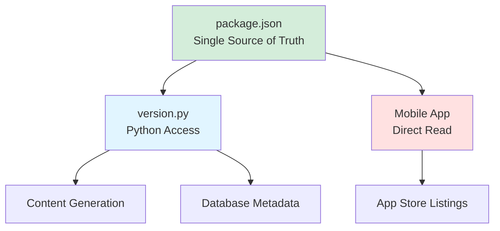

# Versioning Strategy

## Overview

AHLingo uses a **centralized versioning strategy** with a single source of truth. This document explains how versions are managed across the content generation system, mobile app, and databases.

## What Gets Versioned?

Three things need version tracking:

1. **App Version** - The mobile application itself
2. **Content Version** - The exercises and content in content.db
3. **User Schema Version** - The userdata.db schema

All three are coordinated but serve different purposes.

## Single Source of Truth: package.json

**The Problem**: Version drift across systems

Before centralization:
- ❌ Content generation system: version in `__version__.py`
- ❌ Mobile app: version in `package.json`
- ❌ Database: version in metadata table
- ❌ Different versions → confusion and bugs

**The Solution**: One source of truth

After centralization:
- ✅ Mobile app: `ahlingo_mobile/package.json` (source of truth)
- ✅ Content generation: `version.py` reads from package.json
- ✅ Database: Calculated from package.json version



## Version Format: Semantic Versioning

All versions follow **semantic versioning** (semver):

```
MAJOR.MINOR.PATCH

Examples:
1.0.0 - Initial release
1.1.0 - New features
1.1.1 - Bug fixes
2.0.0 - Breaking changes
```

### What Each Number Means

**MAJOR** (Breaking Changes):
- Database schema changes incompatible with old app
- Removed features
- API changes that break existing code
- Requires all users to update

**MINOR** (New Features):
- New exercise types
- New languages
- New topics
- Backwards-compatible additions

**PATCH** (Bug Fixes):
- Exercise corrections
- Translation fixes
- Performance improvements
- Bug fixes

## Database Version Calculation

Database versions use a special integer format for easy comparison:

**Formula**:
```
database_version = major * 100 + minor * 10 + patch
```

**Examples**:
```
1.0.0  →  100   (1 * 100 + 0 * 10 + 0)
1.4.0  →  140   (1 * 100 + 4 * 10 + 0)
1.6.0  →  160   (1 * 100 + 6 * 10 + 0)
1.6.1  →  161   (1 * 100 + 6 * 10 + 1)
2.0.0  →  200   (2 * 100 + 0 * 10 + 0)
```

**Why Integer Format?**

- ✅ Easy comparison: `161 > 160` (no string parsing)
- ✅ SQLite-friendly: Store as INTEGER
- ✅ Sortable: Can ORDER BY version
- ✅ Compact: Single number

**Code** (`version.py`):
```python
def get_database_version() -> int:
    """
    Get database version as an integer.
    Database version follows: major * 100 + minor * 10 + patch

    Returns:
        Integer database version
    """
    major, minor, patch = get_version_tuple()
    return major * 100 + minor * 10 + patch
```

## How Versions Are Read

### Content Generation System

**File**: `version.py`

**Usage**:
```python
from version import __version__, DATABASE_VERSION

print(f"App Version: {__version__}")        # "1.6.0"
print(f"Database Version: {DATABASE_VERSION}")  # 160
```

**Implementation**:
```python
import json
from pathlib import Path

PACKAGE_JSON_PATH = Path(__file__).parent / "ahlingo_mobile" / "package.json"

def get_version() -> str:
    with open(PACKAGE_JSON_PATH, "r") as f:
        package_data = json.load(f)
        return package_data.get("version", "0.0.0")
```

**Key Insight**: Python reads from package.json, not its own version file.

### Mobile App

**File**: `ahlingo_mobile/package.json`

**Direct Read**:
```json
{
  "name": "ahlingo",
  "version": "1.6.0",
  "description": "Language learning app"
}
```

**TypeScript Usage**:
```typescript
import packageJson from '../package.json';

const APP_VERSION = packageJson.version;  // "1.6.0"
```

**Display to User**:
```typescript
// AboutScreen.tsx
<Text>Version {packageJson.version}</Text>
```

### Database Metadata

**content.db** stores version in `database_metadata` table:

**Schema**:
```sql
CREATE TABLE database_metadata (
    key TEXT PRIMARY KEY,
    value TEXT
);

INSERT INTO database_metadata (key, value)
VALUES ('version', '160');  -- Stored as integer version
```

**Query**:
```typescript
const result = await db.executeSql(`
  SELECT value FROM content.database_metadata WHERE key = 'version'
`);
const contentVersion = parseInt(result.rows.item(0).value);
```

**userdata.db** stores schema version in `schema_version` table:

**Schema**:
```sql
CREATE TABLE schema_version (
    version INTEGER PRIMARY KEY
);

INSERT INTO schema_version (version) VALUES (1);
```

**Query**:
```typescript
const result = await db.executeSql(`
  SELECT version FROM schema_version
`);
const schemaVersion = result.rows.item(0).version;
```

## Version Bump Workflow

### When to Bump Versions

**MAJOR** (x.0.0):
- Breaking database schema changes
- Removed exercise types
- Incompatible API changes

**MINOR** (1.x.0):
- New languages added
- New topics added
- New features (no breaking changes)

**PATCH** (1.6.x):
- Bug fixes
- Exercise corrections
- Performance improvements

### How to Bump Version

**Step 1**: Update package.json
```bash
cd ahlingo_mobile

# Option 1: Manual edit
vim package.json
# Change: "version": "1.6.0" → "1.6.1"

# Option 2: npm version command
npm version patch  # 1.6.0 → 1.6.1
npm version minor  # 1.6.0 → 1.7.0
npm version major  # 1.6.0 → 2.0.0
```

**Step 2**: Update database versions
```bash
cd ..
python scripts/update_database_version.py
```

**What This Script Does**:
```python
# Read version from package.json
version = get_version()
db_version = get_database_version()

# Update content.db
UPDATE content.database_metadata
SET value = '{db_version}'
WHERE key = 'version';

# Update userdata_template.db (if schema changed)
# (Manual migration required)
```

**Step 3**: Commit changes
```bash
git add ahlingo_mobile/package.json
git add assets/databases/content.db
git commit -m "Bump version to 1.6.1"
git tag v1.6.1
git push origin main --tags
```

**Step 4**: Build and deploy
```bash
# Build app with new version
npm run ios:build
npm run android:build

# Deploy to app stores
```

## Version Compatibility

### Compatibility Matrix

| Content DB | App Version | Result | Action |
|------------|-------------|---------|--------|
| 1.6.0 (160) | 1.6.0 | ✅ **Perfect Match** | Normal operation |
| 1.6.1 (161) | 1.6.0 | ✅ **Patch Difference** | Works fine, no warning |
| 1.7.0 (170) | 1.6.0 | ⚠️ **Minor Difference** | Works, show warning to update |
| 2.0.0 (200) | 1.6.0 | ❌ **Major Difference** | Incompatible, force update |
| 1.6.0 (160) | 1.7.0 | ⚠️ **App Newer** | Works, recommend content update |

### Compatibility Check Code

**File**: `src/utils/databaseUtils.ts`

```typescript
interface VersionInfo {
  major: number;
  minor: number;
  patch: number;
}

function parseVersion(versionStr: string): VersionInfo {
  const [major, minor, patch] = versionStr.split('.').map(Number);
  return { major, minor, patch };
}

function checkVersionCompatibility(
  contentVersion: number,
  appVersion: string
): { compatible: boolean; level: 'ok' | 'warning' | 'error'; message: string } {
  // Convert integer version to semantic version
  const contentMajor = Math.floor(contentVersion / 100);
  const contentMinor = Math.floor((contentVersion % 100) / 10);
  const contentPatch = contentVersion % 10;

  // Parse app version
  const app = parseVersion(appVersion);

  // Check major version
  if (contentMajor !== app.major) {
    return {
      compatible: false,
      level: 'error',
      message: `Content database version ${contentMajor}.x.x is incompatible with app version ${appVersion}. Please update the app.`
    };
  }

  // Check minor version
  if (contentMinor !== app.minor) {
    return {
      compatible: true,
      level: 'warning',
      message: `Content version ${contentMajor}.${contentMinor}.x differs from app version ${appVersion}. Consider updating.`
    };
  }

  // Patch differences are fine
  return {
    compatible: true,
    level: 'ok',
    message: 'Versions match'
  };
}
```

**Usage**:
```typescript
const contentVersion = await getContentVersion(db);
const appVersion = packageJson.version;

const result = checkVersionCompatibility(contentVersion, appVersion);

if (result.level === 'error') {
  // Show blocking error
  Alert.alert('Version Mismatch', result.message);
  throw new Error(result.message);
} else if (result.level === 'warning') {
  // Show non-blocking warning
  console.warn(result.message);
  // Could show toast notification
}
```

## User Schema Versioning

User schema versions are independent from app/content versions.

**Why Separate?**

- User schema changes independently of content
- Can have app v1.6.0 with user schema v3
- Migration tracking separate from app version

### Schema Version Management

**File**: `src/services/UserSchemaMigrationService.ts`

**Migrations Array**:
```typescript
export const USER_SCHEMA_MIGRATIONS: Migration[] = [
  {
    version: 1,
    description: 'Initial schema',
    up: async (db) => {
      // Initial tables created by template
    }
  },
  {
    version: 2,
    description: 'Add email to users',
    up: async (db) => {
      await db.executeSql(`ALTER TABLE users ADD COLUMN email TEXT`);
    }
  },
  {
    version: 3,
    description: 'Create notifications table',
    up: async (db) => {
      await db.executeSql(`
        CREATE TABLE notifications (
          id INTEGER PRIMARY KEY,
          user_id INTEGER,
          message TEXT,
          read BOOLEAN DEFAULT 0,
          FOREIGN KEY (user_id) REFERENCES users(id)
        )
      `);
    }
  }
];
```

**Version Tracking**:
```sql
-- Current schema version stored in table
SELECT version FROM schema_version;
-- Returns: 2 (if migration 2 is latest applied)
```

**Migration on Launch**:
```typescript
async function migrateUserSchema(db: SQLiteDatabase) {
  const currentVersion = await getCurrentSchemaVersion(db);

  const pending = USER_SCHEMA_MIGRATIONS.filter(
    m => m.version > currentVersion
  );

  for (const migration of pending) {
    console.log(`Applying migration ${migration.version}: ${migration.description}`);

    await db.transaction(async (tx) => {
      await migration.up(tx);
      await updateSchemaVersion(tx, migration.version);
    });
  }
}
```

## Version Display

### In Mobile App

**About Screen** (`src/screens/AboutScreen.tsx`):
```typescript
import packageJson from '../package.json';

const AboutScreen = () => {
  const [contentVersion, setContentVersion] = useState<number | null>(null);
  const [schemaVersion, setSchemaVersion] = useState<number | null>(null);

  useEffect(() => {
    loadVersions();
  }, []);

  const loadVersions = async () => {
    const db = await openDatabase();

    // Get content version
    const contentResult = await db.executeSql(`
      SELECT value FROM content.database_metadata WHERE key = 'version'
    `);
    setContentVersion(parseInt(contentResult.rows.item(0).value));

    // Get schema version
    const schemaResult = await db.executeSql(`
      SELECT version FROM schema_version
    `);
    setSchemaVersion(schemaResult.rows.item(0).version);
  };

  return (
    <View>
      <Text>App Version: {packageJson.version}</Text>
      <Text>Content Version: {contentVersion ? formatDatabaseVersion(contentVersion) : 'Loading...'}</Text>
      <Text>Schema Version: {schemaVersion ?? 'Loading...'}</Text>
    </View>
  );
};

function formatDatabaseVersion(dbVersion: number): string {
  const major = Math.floor(dbVersion / 100);
  const minor = Math.floor((dbVersion % 100) / 10);
  const patch = dbVersion % 10;
  return `${major}.${minor}.${patch}`;
}
```

### In Generation System

**CLI Output**:
```bash
python version.py
# Output:
# AhLingo Version: 1.6.0
# Version Tuple: (1, 6, 0)
# Database Version: 160
```

**In Scripts**:
```python
from version import __version__, DATABASE_VERSION

print(f"Generating content for version {__version__}")
print(f"Database version will be: {DATABASE_VERSION}")
```

## Rollback Strategy

### Content Rollback

**Scenario**: Bad content deployed, need to rollback

**Option 1**: App Store Rollback
```bash
# Deploy previous app version with old content.db
# Users update to old version
# Not ideal (requires app store approval)
```

**Option 2**: Content Replacement (Future)
```bash
# If remote content sync implemented:
# Deploy previous content.db to CDN
# Users download old content
# Quick rollback without app store
```

**Option 3**: Local Backup
```typescript
// Keep backup of previous content.db
const backupPath = `${DocumentsDir}/content_backup.db`;

// Before replacing content.db
await RNFS.copyFile(
  `${DocumentsDir}/content.db`,
  backupPath
);

// If new content bad, restore backup
await RNFS.copyFile(
  backupPath,
  `${DocumentsDir}/content.db`
);
```

### Schema Migration Rollback

**Problem**: Migration failed halfway

**Solution 1**: Transactional migrations
```typescript
await db.transaction(async (tx) => {
  await migration.up(tx);
  // If error thrown, entire transaction rolls back
});
```

**Solution 2**: Backup before migration
```typescript
// Copy userdata.db before migration
await RNFS.copyFile(
  `${DocumentsDir}/userdata.db`,
  `${DocumentsDir}/userdata_backup.db`
);

try {
  await migrateUserSchema(db);
} catch (error) {
  // Restore from backup
  await RNFS.copyFile(
    `${DocumentsDir}/userdata_backup.db`,
    `${DocumentsDir}/userdata.db`
  );
  throw error;
}
```

## Best Practices

### DO:

✅ **Always update package.json first** (single source of truth)

✅ **Use semantic versioning** (major.minor.patch)

✅ **Tag releases in git**:
```bash
git tag v1.6.1
git push --tags
```

✅ **Test version compatibility** before deployment

✅ **Document breaking changes** in changelog

✅ **Check version on app launch**:
```typescript
const compatibility = checkVersionCompatibility(contentVersion, appVersion);
```

✅ **Show version in About screen** (transparency)

### DON'T:

❌ **Don't hardcode versions** in multiple places

❌ **Don't skip version bumps** (tracking breaks)

❌ **Don't change version format** (major.minor.patch only)

❌ **Don't deploy without testing** version compatibility

❌ **Don't reuse version numbers** (each release unique)

❌ **Don't modify past migration versions** (breaks migration system)

## Troubleshooting

### "Version not found in package.json"

**Symptoms**: version.py returns "0.0.0"

**Cause**: package.json missing or malformed

**Solution**:
```bash
# Verify package.json exists
ls -la ahlingo_mobile/package.json

# Check JSON is valid
cat ahlingo_mobile/package.json | python -m json.tool
```

### "Content version mismatch warning"

**Symptoms**: Warning shown to user on app launch

**Cause**: Content version differs from app version (minor/major)

**Solution**:
- **Minor difference**: Update app when convenient
- **Major difference**: Must update app immediately

### "Migration version conflict"

**Symptoms**: Multiple migrations with same version number

**Cause**: Concurrent development without coordination

**Solution**:
```typescript
// Find conflict
const versions = USER_SCHEMA_MIGRATIONS.map(m => m.version);
const duplicates = versions.filter((v, i) => versions.indexOf(v) !== i);

// Renumber conflicting migrations
// Update version numbers to be sequential
```

### "Database version not updating"

**Symptoms**: Version shows old number after update

**Cause**: Script didn't run or database not replaced

**Solution**:
```bash
# 1. Verify package.json updated
cat ahlingo_mobile/package.json | grep version

# 2. Run update script
python scripts/update_database_version.py

# 3. Verify database updated
sqlite3 assets/databases/content.db "SELECT value FROM database_metadata WHERE key = 'version'"

# 4. Rebuild app
npm run android:build
```

## See Also

- [Content Pipeline](content-pipeline.md) - How versions flow through pipeline
- [Database Architecture](../mobile/database.md) - Database version tracking
- [Content Generation Architecture](../generation/architecture.md) - Setting versions in content

---

**Next Steps**:
- Review [Content Pipeline](content-pipeline.md) for deployment workflow
- Learn [Database Architecture](../mobile/database.md) for version storage
- Practice version bumping with test releases
