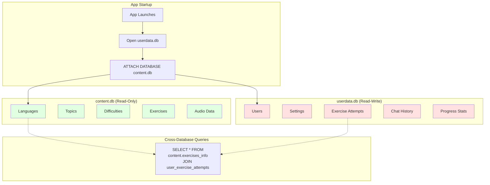
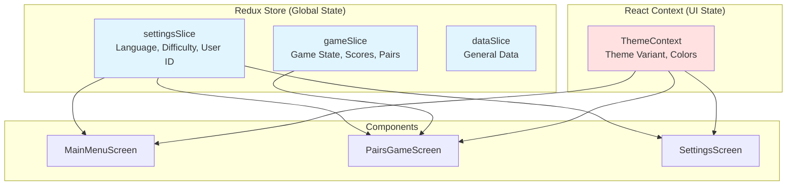
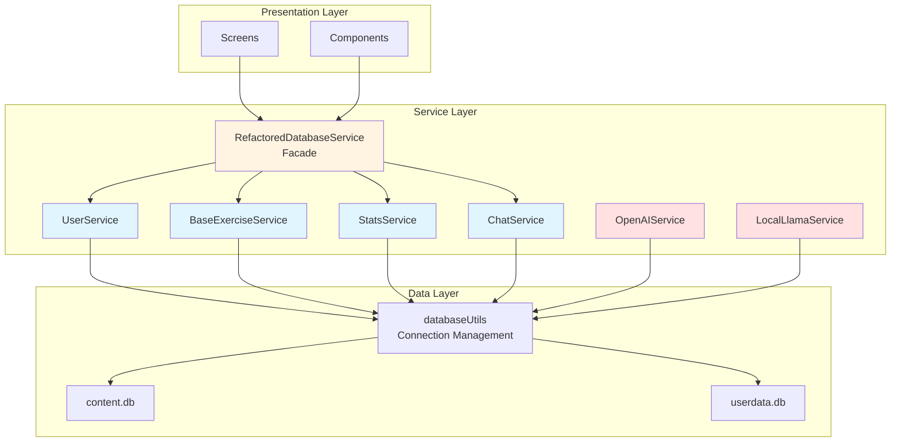
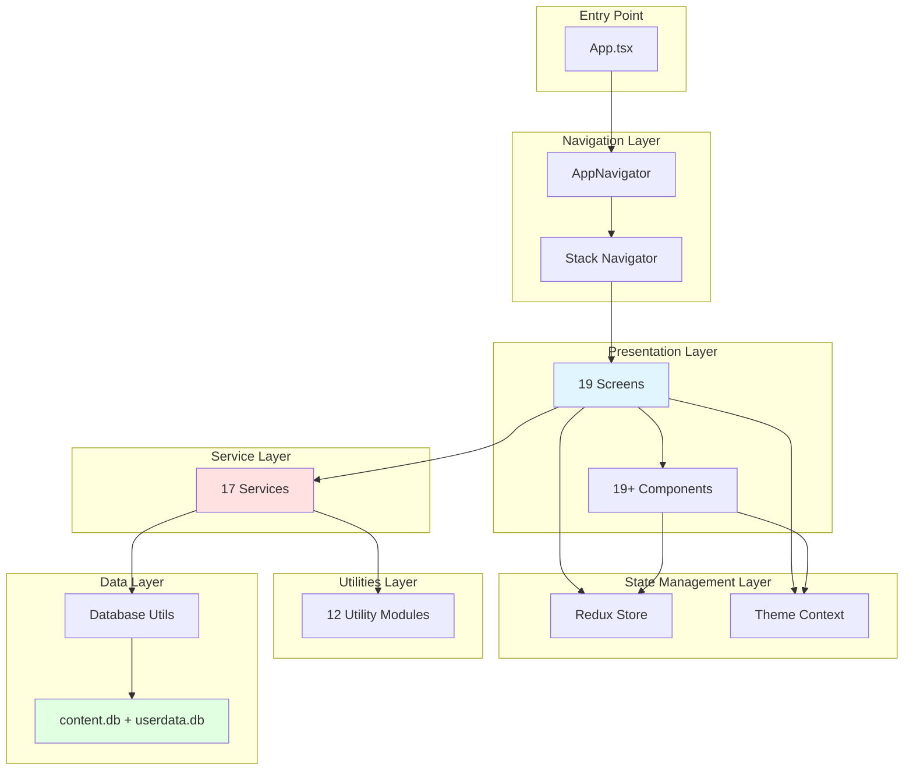

# Mobile App Architecture

## Overview

The AHLingo mobile app is a cross-platform language learning application built with React Native and TypeScript. This document explains the architectural decisions, design rationale, and system structure.

## What is the Mobile App?

The mobile app is a **React Native application** that:

1. Delivers language learning exercises to users
2. Tracks user progress and statistics
3. Provides AI-powered chat practice (OpenAI + local LLM)
4. Manages two separate SQLite databases (content + user data)
5. Supports multiple languages and difficulty levels
6. Works offline (with local LLM support)

**Platforms**: iOS and Android

## Why This Architecture?

### The Problems We're Solving

Building a mobile language learning app has unique challenges:

1. **Content Updates**: How to ship new exercises without risking user progress?
2. **Offline Support**: How to work without constant internet connectivity?
3. **State Management**: How to manage complex app state without over-engineering?
4. **Data Persistence**: How to store both static content and dynamic user data?
5. **AI Integration**: How to support both cloud and local LLMs?

Our architecture solves these problems with specific design decisions.

## Core Architectural Decision #1: Two-Database Architecture

The most important architectural decision in this app is using **two separate SQLite databases** instead of one.



### Why Two Databases?

**The Problem**: Traditional single-database approach

With one database containing both content and user data:
- ❌ Content updates risk data loss (schema migrations can fail)
- ❌ Can't simply replace database file (user data would be lost)
- ❌ Complex migrations when adding exercises
- ❌ Backup/restore is all-or-nothing

**Our Solution**: Separate concerns

**content.db** (bundled, read-only):
- ✅ Can be completely replaced on app update
- ✅ No risk to user data
- ✅ Simple deployment (copy new file)
- ✅ No migrations needed (just replace)
- ✅ ~5.9MB, shipped with app

**userdata.db** (created on device, read-write):
- ✅ Never touched by app updates
- ✅ Standard migration patterns apply
- ✅ Easy backup/restore (single file)
- ✅ Grows with usage (~36KB start)

### How Database Attachment Works

SQLite supports attaching multiple databases:

```typescript
// 1. Open primary database (userdata.db)
const db = await openDatabase('userdata.db');

// 2. Attach content database
await db.executeSql(
  `ATTACH DATABASE '${contentDbPath}' AS content`
);

// 3. Query across both databases
const results = await db.executeSql(`
  SELECT
    content.exercises_info.*,
    user_exercise_attempts.is_correct
  FROM content.exercises_info
  LEFT JOIN user_exercise_attempts
    ON content.exercises_info.id = user_exercise_attempts.exercise_id
  WHERE user_exercise_attempts.user_id = ?
`);
```

**Key Insight**: Use `content.` prefix for content database tables.

[Deep dive: Database Architecture →](database.md)

### Trade-offs

**Complexity**: Two databases is more complex than one
- More initialization code
- Need to prefix content tables with `content.`
- Two version tracking systems

**Benefits Outweigh Complexity**:
- Zero risk content updates
- Simpler deployment
- Better separation of concerns
- Independent schema evolution

**Alternative Considered**: Single database with complex migrations
- ✅ Simpler initialization
- ❌ Content updates risky
- ❌ Migration failures can lose data
- ❌ Can't just "replace content"

**Decision**: Two databases. The safety and simplicity of content updates is worth the initialization complexity.

## Core Architectural Decision #2: Redux + Context Hybrid

The app uses **both Redux and React Context** for state management, not just one.



### Why Both Redux AND Context?

**Redux for Global App State**:
- Settings (language, difficulty, user ID)
- Game state (score, selected pairs, correct answers)
- Data state (general application data)

**Why Redux for This?**
- ✅ Time-travel debugging (DevTools)
- ✅ Predictable state updates (actions + reducers)
- ✅ Easy testing (pure functions)
- ✅ State persistence (easy to save/restore)

**React Context for UI State**:
- Theme (frost/aurora/polar color schemes)

**Why Context for This?**
- ✅ Changes frequently (theme switching)
- ✅ Doesn't need history
- ✅ Simple read/write (no complex logic)
- ✅ Less boilerplate than Redux

### Why Not Just Redux?

If we used Redux for everything:
- Theme updates would trigger Redux DevTools logging (noisy)
- Theme changes don't need time-travel debugging
- More boilerplate for simple state
- Overkill for UI preferences

### Why Not Just Context?

If we used Context for everything:
- Can't time-travel debug game state
- Harder to test (Context requires components)
- No built-in persistence
- Harder to trace state changes

**Trade-off**: Slightly more complexity (two state systems) for better separation of concerns.

**Pattern**: Use Redux for business logic state, Context for UI state.

## Core Architectural Decision #3: Service Layer

The app uses a **service layer** to separate business logic from UI components.



### Why a Service Layer?

**The Problem**: Without service layer, components directly query database
- ❌ Business logic mixed with UI code
- ❌ Hard to test (need to mock database in every component)
- ❌ Duplication (same queries in multiple components)
- ❌ Hard to change database structure

**Our Solution**: Service layer abstracts data access

**Benefits**:
- ✅ Business logic centralized
- ✅ Easy to test (mock services, not database)
- ✅ Reusable (one service, many components)
- ✅ Database changes isolated to services

**Example**:
```typescript
// Without service layer (BAD)
const Component = () => {
  const [exercises, setExercises] = useState([]);

  useEffect(() => {
    const db = await openDatabase();
    const results = await db.executeSql(`
      SELECT * FROM content.exercises_info
      WHERE language_id = ? AND difficulty_id = ?
    `, [language, difficulty]);
    setExercises(results.rows);
  }, [language, difficulty]);
};

// With service layer (GOOD)
const Component = () => {
  const [exercises, setExercises] = useState([]);

  useEffect(() => {
    const results = await BaseExerciseService.getExercises(
      language, topic, difficulty, 'pairs', 10
    );
    setExercises(results);
  }, [language, difficulty]);
};
```

### Service Patterns

**Facade Pattern**: `RefactoredDatabaseService` provides high-level API

```typescript
// RefactoredDatabaseService.ts
export class RefactoredDatabaseService {
  static async getExercises(...) {
    return BaseExerciseService.getExercises(...);
  }

  static async getUserStats(...) {
    return StatsService.getUserStats(...);
  }

  // ... more methods
}
```

**Why Facade?**
- Single entry point for components
- Backward compatibility during refactoring
- Easy to add caching/middleware

**Composition Pattern**: Services compose functionality

```typescript
// StatsService.ts
export class StatsService {
  static async getUserStats(userId: number) {
    // Composes data from multiple sources
    const attempts = await BaseExerciseService.getUserAttempts(userId);
    const exercises = await BaseExerciseService.getAllExercises();
    return this.computeStats(attempts, exercises);
  }
}
```

**Why Composition?**
- Reuse lower-level services
- Clear dependencies
- Easy to test (mock dependencies)

See the Service Patterns section above for how services compose.

## Technology Choices

### React Native 0.80.0

**Why React Native?**
- ✅ Cross-platform (iOS + Android from one codebase)
- ✅ JavaScript/TypeScript (large developer pool)
- ✅ Hot reload (fast development)
- ✅ Native performance (bridges to native code)

**Why Not Flutter/Xamarin/Native?**

**Flutter**:
- ✅ Fast
- ❌ Dart (smaller developer pool)
- ❌ Less mature ecosystem

**Xamarin**:
- ✅ C# (good for .NET teams)
- ❌ Deprecated (Microsoft moved to MAUI)

**Native (Swift/Kotlin)**:
- ✅ Best performance
- ❌ Two codebases (iOS + Android)
- ❌ Double the development time

**Decision**: React Native offers best balance of performance, cross-platform, and developer experience.

### TypeScript

**Why TypeScript?**
- ✅ Type safety (catch errors at compile time)
- ✅ Better IDE support (autocomplete, refactoring)
- ✅ Self-documenting code
- ✅ Easier refactoring

**Why Not Plain JavaScript?**
- Runtime type errors
- No autocomplete
- Harder to refactor

**Trade-off**: Learning curve, but worth it for large codebases.

### Redux Toolkit 2.8.2

**Why Redux Toolkit?**
- ✅ Less boilerplate than raw Redux
- ✅ Built-in immer (immutable updates)
- ✅ DevTools integration
- ✅ TypeScript support

**Why Not MobX/Zustand/Recoil?**

**MobX**:
- ✅ Less boilerplate
- ❌ Magic (observable, autorun)
- ❌ Harder to debug

**Zustand**:
- ✅ Simple API
- ❌ No time-travel debugging
- ❌ Less ecosystem

**Recoil**:
- ✅ Fine-grained reactivity
- ❌ Still experimental
- ❌ Limited ecosystem

**Decision**: Redux Toolkit is mature, well-supported, and provides excellent debugging.

### SQLite (react-native-sqlite-storage)

**Why SQLite?**
- ✅ Offline-first (no server needed)
- ✅ Fast queries
- ✅ Relational data (exercises, users, attempts)
- ✅ Works on iOS/Android

**Why Not AsyncStorage/Realm/Firebase?**

**AsyncStorage**:
- ✅ Simple API
- ❌ Key-value only (no relations)
- ❌ Slow for complex queries

**Realm**:
- ✅ Object-oriented
- ❌ Proprietary (vendor lock-in)
- ❌ Migration complexity

**Firebase**:
- ✅ Real-time sync
- ❌ Requires internet
- ❌ Costs money at scale

**Decision**: SQLite perfect for offline-first, relational data.

## App Layer Architecture



### Layers Explained

**1. Entry Point (`App.tsx`)**
- App initialization
- Provider setup (Redux, Theme)
- Database initialization
- Navigation mounting

**2. Navigation Layer (`AppNavigator.tsx`)**
- Route definitions
- Stack-based navigation
- Conditional routing (Welcome vs MainMenu)

**3. Presentation Layer (Screens + Components)**
- 19 screens (MainMenu, PairsGame, Chatbot, etc.)
- 19+ reusable components (PairButton, TopicCard, etc.)
- UI logic only, no business logic

**4. State Management Layer (Redux + Context)**
- Redux: settings, game, data slices
- Context: theme
- Actions and reducers

**5. Service Layer (17 services)**
- Business logic
- Data access
- API integration
- Abstracts database queries

**6. Utilities Layer (12 modules)**
- Pure functions
- Helper utilities
- No state, no side effects

**7. Data Layer (SQLite)**
- Two databases (content + userdata)
- Connection management
- Transaction handling

## Entry Points for Code Exploration

When exploring the mobile codebase, start here:

### 1. App Initialization
**File**: `App.tsx`

**What**: Entry point, provider setup

**Start Reading At**:
- Redux Provider setup
- Theme Provider setup
- Database initialization call
- Navigation mounting

### 2. Database Initialization
**File**: `src/utils/databaseUtils.ts` (300+ lines)

**What**: Two-database initialization, connection management

**Start Reading At**:
- `initializeDatabases()` - Main initialization
- `openDatabase()` - Connection helper
- `attachContentDatabase()` - Database attachment
- `executeWithTimeout()` - Query timeout wrapper

**Why This File?**: Understanding database setup is critical for everything else.

### 3. Main Database Facade
**File**: `src/services/RefactoredDatabaseService.ts`

**What**: High-level API for all database operations

**Start Reading At**:
- Public static methods (entry points for components)
- Service delegation pattern

**Why This File?**: This is what components actually call.

### 4. Main Menu
**File**: `src/screens/MainMenuScreen.tsx` (298 lines)

**What**: App entry point after login

**Start Reading At**:
- Menu options structure
- Navigation handlers
- Redux state access

**Why This File?**: Shows how screens use services and navigation.

### 5. Navigation Structure
**File**: `src/navigation/AppNavigator.tsx`

**What**: Route definitions and navigation setup

**Start Reading At**:
- Stack.Screen definitions
- Route hierarchy
- Navigation params

**Why This File?**: Understand app flow and screen relationships.

### 6. Settings Slice
**File**: `src/store/settingsSlice.ts`

**What**: Redux state management for settings

**Start Reading At**:
- Initial state
- Reducers (setLanguage, setDifficulty, etc.)
- Async thunks (if any)

**Why This File?**: Shows Redux patterns used throughout app.

### 7. Exercise Service
**File**: `src/services/BaseExerciseService.ts`

**What**: Exercise retrieval and attempt recording

**Start Reading At**:
- `getExercises()` - Main query method
- `recordAttempt()` - Progress tracking
- SQL query construction

**Why This File?**: Core business logic for exercises.

### 8. OpenAI Integration
**File**: `src/services/OpenAIService.ts`

**What**: Chat API integration

**Start Reading At**:
- `sendMessage()` - API call
- System prompt generation
- Error handling

**Why This File?**: Shows API integration patterns.

## Common Patterns

### Pattern 1: Service Usage in Screens

```typescript
// Screen component
const MyScreen = () => {
  const [exercises, setExercises] = useState([]);
  const { language, difficulty } = useSelector(state => state.settings);

  useEffect(() => {
    loadExercises();
  }, [language, difficulty]);

  const loadExercises = async () => {
    try {
      const results = await BaseExerciseService.getExercises(
        language, 'Greetings', difficulty, 'pairs', 10
      );
      setExercises(results);
    } catch (error) {
      console.error('Failed to load exercises:', error);
    }
  };

  return (
    <View>
      {exercises.map(ex => <ExerciseCard key={ex.id} {...ex} />)}
    </View>
  );
};
```

**When to Use**: All data-fetching screens

### Pattern 2: Redux State Access

```typescript
// Reading state
const { language, difficulty } = useSelector(state => state.settings);

// Updating state
const dispatch = useDispatch();
dispatch(setLanguage('French'));
```

**When to Use**: Global state (settings, game state)

### Pattern 3: Theme Context Access

```typescript
const { theme, setTheme } = useTheme();

// Use theme colors
<View style={{ backgroundColor: theme.colors.background }}>
```

**When to Use**: UI styling, theme-aware components

### Pattern 4: Cross-Database Query

```typescript
const query = `
  SELECT
    content.exercises_info.*,
    user_exercise_attempts.is_correct,
    user_exercise_attempts.attempted_at
  FROM content.exercises_info
  LEFT JOIN user_exercise_attempts
    ON content.exercises_info.id = user_exercise_attempts.exercise_id
  WHERE
    content.exercises_info.language_id = ?
    AND user_exercise_attempts.user_id = ?
`;
```

**When to Use**: Queries needing both content and user data

## Performance Considerations

### Database Query Timeouts

All database queries use timeout wrappers:

```typescript
export const executeWithTimeout = async (
  operation: () => Promise<any>,
  timeout: number = 5000
) => {
  return Promise.race([
    operation(),
    new Promise((_, reject) =>
      setTimeout(() => reject(new Error('Timeout')), timeout)
    )
  ]);
};
```

**Why?**: Prevent hanging queries from freezing UI.

### Component Memo

```typescript
export const PairButton = React.memo(({ text, onPress, isSelected }) => {
  return <TouchableOpacity onPress={onPress}>...</TouchableOpacity>;
});
```

**When to Use**: Components that render frequently (list items, buttons)

### useMemo for Expensive Calculations

```typescript
const sortedExercises = useMemo(() => {
  return exercises.sort((a, b) => a.difficulty - b.difficulty);
}, [exercises]);
```

**When to Use**: Complex transformations of large arrays

## Testing Strategy

The app uses multi-layer testing:

1. **Unit Tests**: Services, utilities (Jest)
2. **Component Tests**: UI components (React Native Testing Library)
3. **Integration Tests**: Service integration (Jest with mocks)
4. **E2E Tests**: User flows (Detox)

## See Also

- [Database Architecture](database.md) - Deep dive on two-database pattern

---

**Next Steps**:
- Understand [Database Architecture](database.md) (two-database pattern)
- Explore the Service Layer and Service Patterns sections above (business logic layer)
