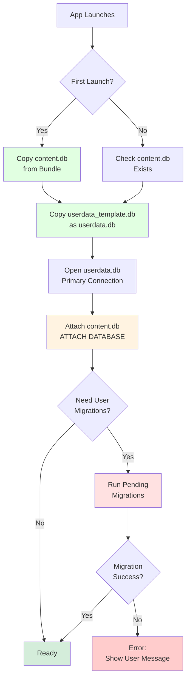

# Database Architecture: Two-Database Pattern

## Overview

The AHLingo mobile app uses a **two-database architecture** - one of its most critical architectural decisions. This document explains what it is, why we use it, how it works, and how to work with it.

## What is the Two-Database Pattern?

Instead of storing everything in one SQLite database, we use **two separate databases**:

1. **content.db** (read-only) - Exercises, languages, topics, etc.
2. **userdata.db** (read-write) - User progress, settings, chat history, etc.

These databases are **attached at runtime** using SQLite's `ATTACH DATABASE` command, allowing queries across both.

## Why Two Databases?

### The Problem: Traditional Single-Database Approach

Most apps use one database for everything. This works fine until you need to update content:

```
┌─────────────────────────────────┐
│   languageLearningDatabase.db   │
│  (Everything in one database)   │
├─────────────────────────────────┤
│ Exercises (need updates)        │
│ Topics (rarely change)          │
│ User Progress (sacred!)         │
│ Settings (sacred!)              │
│ Chat History (sacred!)          │
└─────────────────────────────────┘
```

**Problems**:
- ❌ Content updates risk data loss (migration failures)
- ❌ Can't just "replace" database (would lose user data)
- ❌ Complex migrations every time content changes
- ❌ Testing migrations risky (might lose user progress)
- ❌ Rollback difficult if something goes wrong

**Real Scenario That Scared Us**:
```
Developer adds 100 new exercises
Migration adds new rows to exercises_info table
Migration fails halfway through
User's database corrupted
User loses ALL progress
User uninstalls app 😢
```

### Our Solution: Separate Concerns

Split the database by **update frequency** and **data ownership**:

```
┌──────────────────────────┐  ┌──────────────────────────┐
│      content.db          │  │      userdata.db         │
│   (Read-Only, Bundled)   │  │  (Read-Write, Created)   │
├──────────────────────────┤  ├──────────────────────────┤
│ Exercises ✓              │  │ Users ✓                  │
│ Topics ✓                 │  │ User Settings ✓          │
│ Languages ✓              │  │ Exercise Attempts ✓      │
│ Audio Data ✓             │  │ Chat History ✓           │
│ Database Version ✓       │  │ Schema Version ✓         │
└──────────────────────────┘  └──────────────────────────┘
      ↓ Can Replace              ↓ Never Replaced
```

**Benefits**:
- ✅ Content updates: Just replace content.db (no risk)
- ✅ User data: Never touched by updates (100% safe)
- ✅ Simpler deployments: Copy new content.db, done
- ✅ Independent versioning: Each database tracks its own version
- ✅ Easy rollback: Keep old content.db as backup

## How It Works: Database Attachment

SQLite supports attaching multiple databases to a single connection:

```typescript
// 1. Open primary database (userdata.db)
const db = await SQLite.openDatabase({
  name: 'userdata.db',
  location: 'default'
});

// 2. Attach content database
const contentPath = `${DocumentsDir}/content.db`;
await db.executeSql(
  `ATTACH DATABASE '${contentPath}' AS content`
);

// 3. Now both databases are accessible!
// - userdata.db tables: no prefix needed
// - content.db tables: use "content." prefix
```

### Querying Across Databases

**Query content.db** (use `content.` prefix):
```sql
SELECT * FROM content.exercises_info WHERE id = 1;
SELECT * FROM content.topics WHERE name = 'Greetings';
```

**Query userdata.db** (no prefix needed):
```sql
SELECT * FROM users WHERE id = 1;
SELECT * FROM user_exercise_attempts WHERE user_id = 1;
```

**Join across databases**:
```sql
SELECT
  content.exercises_info.id,
  content.exercises_info.name,
  user_exercise_attempts.is_correct,
  user_exercise_attempts.attempted_at
FROM content.exercises_info
LEFT JOIN user_exercise_attempts
  ON content.exercises_info.id = user_exercise_attempts.exercise_id
WHERE user_exercise_attempts.user_id = ?;
```

**Key Insight**: The `content.` prefix tells SQLite which database to use.

## Database Schemas

### content.db (Read-Only Content)

**Location**: Bundled in app, copied to `Documents/content.db` on first launch

**Size**: ~5.9 MB

**Tables**:

| Table | Purpose | Example Data |
|-------|---------|--------------|
| `database_metadata` | Content version tracking | `version = 160` (1.6.0) |
| `languages` | Supported languages | French, Spanish, German |
| `difficulties` | Difficulty levels | beginner, intermediate, advanced |
| `topics` | Exercise topics | Greetings, Food, Travel |
| `exercises_info` | Exercise metadata | exercise ID, language, topic, type |
| `pair_exercises` | Word pairs | Hello → Bonjour |
| `conversation_exercises` | Dialogue turns | Speaker, message, turn order |
| `conversation_summaries` | Conversation context | "Marie and Jean greet each other" |
| `translation_exercises` | Sentence translations | English ↔ French |
| `fill_in_blank_exercises` | Cloze exercises | Sentence with blank, answers |
| `pronunciation_audio` | Pre-generated audio | TTS audio BLOBs |

**Update Strategy**: Complete replacement
- New app version ships with new content.db
- Old content.db is overwritten
- Zero risk to user data

**Version Tracking**:
```sql
-- Stored in database_metadata table
INSERT INTO database_metadata (key, value)
VALUES ('version', '160');  -- 1.6.0 → 160
```

### userdata.db (Read-Write User Data)

**Location**: Created in `Documents/userdata.db` on first launch

**Size**: Starts at ~36 KB, grows with usage

**Tables**:

| Table | Purpose | Example Data |
|-------|---------|--------------|
| `schema_version` | User schema version | `version = 2` |
| `users` | User accounts | User ID, name, created_at |
| `user_settings` | User preferences | Language, difficulty, theme |
| `user_exercise_attempts` | Complete history | Exercise ID, correct/incorrect, timestamp |
| `chat_details` | AI chat sessions | Chat ID, language, difficulty, model |
| `chat_histories` | AI chat messages | Chat ID, role, content, timestamp |

**Update Strategy**: Schema migrations only
- Never replaced
- Migrations applied incrementally
- Version tracked in `schema_version` table

**Migration Example**:
```typescript
{
  version: 2,
  description: 'Add email field to users',
  up: async (db: SQLiteDatabase) => {
    await db.executeSql(`
      ALTER TABLE users ADD COLUMN email TEXT;
    `);
  }
}
```

## Initialization Flow

Understanding how the databases are initialized is crucial:



### Step-by-Step Initialization

**File**: `src/utils/databaseUtils.ts` (300+ lines)

**1. Copy Bundled Databases** (first launch only):
```typescript
// Copy content.db from app bundle to Documents/
await RNFS.copyFileAssets(
  'databases/content.db',
  `${DocumentsDir}/content.db`
);

// Copy userdata template from bundle to Documents/
await RNFS.copyFileAssets(
  'databases/userdata_template.db',
  `${DocumentsDir}/userdata.db`
);
```

**2. Open Primary Database** (userdata.db):
```typescript
const db = await SQLite.openDatabase({
  name: 'userdata.db',
  location: 'default'
});
```

**3. Attach Content Database**:
```typescript
await db.executeSql(
  `ATTACH DATABASE '${contentDbPath}' AS content`
);
```

**4. Run User Schema Migrations** (if needed):
```typescript
await migrateUserSchema(db);
```

**5. Ready to Use**:
```typescript
// App can now query both databases
const exercises = await db.executeSql(`
  SELECT * FROM content.exercises_info LIMIT 10
`);
```

## Content Updates: The Killer Feature

This is where the two-database architecture really shines.

### Traditional Approach (Single Database)

```
User has 1000 completed exercises
Developer adds 100 new exercises
Create migration to insert 100 rows
Run migration on user's device
Migration fails (network issue, low storage, etc.)
User loses progress
😱 Disaster
```

### Our Approach (Two Databases)

```
User has 1000 completed exercises in userdata.db
Developer adds 100 new exercises to content.db
Ship new app version with new content.db
On app update:
  - Old content.db deleted
  - New content.db copied from bundle
  - userdata.db untouched
User still has 1000 completed + 100 new available
😊 Success
```

### Content Update Workflow

**Step 1**: Developer adds exercises to source database
```bash
# Edit the monolithic source database
# assets/databases/languageLearningDatabase.db
```

**Step 2**: Split into two databases
```bash
node scripts/splitDatabase.js
# Creates: content.db + userdata_template.db
```

**Step 3**: Bump version
```typescript
// Update version in content.database_metadata
UPDATE database_metadata
SET value = '161'  // 1.6.1
WHERE key = 'version';
```

**Step 4**: Build and deploy app
```bash
# Build app with new content.db bundled
npm run android:build
# or
npm run ios:build
```

**Step 5**: User updates app
```
App detects new content version
Replaces content.db with bundled version
Attaches to existing userdata.db
New content instantly available
```

**Key Insight**: User data and content are completely decoupled.

## User Schema Migrations

While content.db can be replaced, userdata.db requires traditional migrations.

### When Do You Need Migrations?

**Examples**:
- Adding a new field to `users` table
- Creating a new table for a new feature
- Changing column types
- Adding indexes for performance

**What You Don't Need Migrations For**:
- Adding exercises (that's content.db)
- Updating topics (that's content.db)
- Changing difficulty levels (that's content.db)

### Migration System

**File**: `src/services/UserSchemaMigrationService.ts`

**Migration Structure**:
```typescript
interface Migration {
  version: number;         // Sequential version (1, 2, 3, ...)
  description: string;     // What this migration does
  up: (db: SQLiteDatabase) => Promise<void>;  // Migration function
}

export const USER_SCHEMA_MIGRATIONS: Migration[] = [
  {
    version: 1,
    description: 'Initial user schema',
    up: async (db) => {
      // Tables created by userdata_template.db
      // No-op migration (just marks version 1 as applied)
    }
  },
  {
    version: 2,
    description: 'Add email field to users',
    up: async (db) => {
      await db.executeSql(`
        ALTER TABLE users ADD COLUMN email TEXT;
      `);
    }
  },
  {
    version: 3,
    description: 'Create notifications table',
    up: async (db) => {
      await db.executeSql(`
        CREATE TABLE notifications (
          id INTEGER PRIMARY KEY AUTOINCREMENT,
          user_id INTEGER,
          message TEXT,
          read BOOLEAN DEFAULT 0,
          created_at DATETIME DEFAULT CURRENT_TIMESTAMP,
          FOREIGN KEY (user_id) REFERENCES users(id)
        );
      `);
    }
  }
];
```

### How Migrations Run

**1. Check Current Version**:
```typescript
const currentVersion = await getCurrentSchemaVersion(db);
// Returns: 1 (if version 1 is latest applied)
```

**2. Find Pending Migrations**:
```typescript
const pendingMigrations = USER_SCHEMA_MIGRATIONS.filter(
  m => m.version > currentVersion
);
// Returns: [migration2, migration3]
```

**3. Apply Migrations Sequentially**:
```typescript
for (const migration of pendingMigrations) {
  await db.transaction(async (tx) => {
    await migration.up(tx);
    await updateSchemaVersion(tx, migration.version);
  });
}
```

**4. Update Version**:
```sql
UPDATE schema_version SET version = 3;
```

**Key Features**:
- ✅ Transactional (all-or-nothing)
- ✅ Sequential (applied in order)
- ✅ Idempotent (won't re-run)
- ✅ Version tracked (knows what's applied)

### Adding a New Migration

**Step 1**: Add migration to array:
```typescript
{
  version: 4,  // Next sequential number
  description: 'Add theme preference to users',
  up: async (db) => {
    await db.executeSql(`
      ALTER TABLE users ADD COLUMN theme TEXT DEFAULT 'frost';
    `);
  }
}
```

**Step 2**: Test locally:
```bash
# Build and run app
# Migration runs automatically on launch
# Check logs for success
```

**Step 3**: Deploy:
```bash
# No special steps needed
# Migration runs on user's device when they update
```

**Important**: Never change version numbers of existing migrations!

## Query Patterns

### Pattern 1: Fetch Content Only

```typescript
// Get all exercises for a topic
const exercises = await db.executeSql(`
  SELECT * FROM content.exercises_info
  WHERE topic_id = ? AND difficulty_id = ?
`, [topicId, difficultyId]);
```

**When to Use**: Fetching exercises, topics, languages

### Pattern 2: Fetch User Data Only

```typescript
// Get user's settings
const settings = await db.executeSql(`
  SELECT * FROM user_settings
  WHERE user_id = ?
`, [userId]);
```

**When to Use**: User preferences, chat history

### Pattern 3: Join Content + User Data

```typescript
// Get exercises with user's attempt status
const exercisesWithProgress = await db.executeSql(`
  SELECT
    content.exercises_info.id,
    content.exercises_info.name,
    user_exercise_attempts.is_correct,
    user_exercise_attempts.attempted_at
  FROM content.exercises_info
  LEFT JOIN user_exercise_attempts
    ON content.exercises_info.id = user_exercise_attempts.exercise_id
    AND user_exercise_attempts.user_id = ?
  WHERE content.exercises_info.topic_id = ?
`, [userId, topicId]);
```

**When to Use**: Showing progress, completed exercises, stats

### Pattern 4: Aggregate User Progress

```typescript
// Calculate completion percentage
const stats = await db.executeSql(`
  SELECT
    COUNT(DISTINCT content.exercises_info.id) as total_exercises,
    COUNT(DISTINCT user_exercise_attempts.exercise_id) as attempted_exercises,
    COUNT(CASE WHEN user_exercise_attempts.is_correct = 1 THEN 1 END) as correct_exercises
  FROM content.exercises_info
  LEFT JOIN user_exercise_attempts
    ON content.exercises_info.id = user_exercise_attempts.exercise_id
    AND user_exercise_attempts.user_id = ?
  WHERE content.exercises_info.topic_id = ?
`, [userId, topicId]);

const completion = (stats.rows.item(0).correct_exercises / stats.rows.item(0).total_exercises) * 100;
```

**When to Use**: Stats screen, progress tracking

## Common Pitfalls and Solutions

### Pitfall 1: Forgetting `content.` Prefix

**Problem**:
```typescript
// ❌ Wrong - will fail with "no such table"
await db.executeSql(`
  SELECT * FROM exercises_info WHERE id = ?
`, [exerciseId]);
```

**Solution**:
```typescript
// ✅ Correct - use content. prefix
await db.executeSql(`
  SELECT * FROM content.exercises_info WHERE id = ?
`, [exerciseId]);
```

**Why**: SQLite doesn't know which database `exercises_info` refers to without the prefix.

### Pitfall 2: Querying Before Attachment

**Problem**:
```typescript
const db = await SQLite.openDatabase({name: 'userdata.db'});

// ❌ Wrong - content.db not attached yet
await db.executeSql('SELECT * FROM content.exercises_info');
```

**Solution**:
```typescript
const db = await SQLite.openDatabase({name: 'userdata.db'});
await db.executeSql(`ATTACH DATABASE '${contentPath}' AS content`);

// ✅ Correct - content.db attached
await db.executeSql('SELECT * FROM content.exercises_info');
```

**Why**: Database must be attached before querying.

### Pitfall 3: Modifying content.db at Runtime

**Problem**:
```typescript
// ❌ Wrong - content.db is read-only
await db.executeSql(`
  INSERT INTO content.exercises_info (...) VALUES (...)
`);
```

**Solution**: Don't modify content.db at runtime. It's read-only by design.

**Why**: Content updates should only happen via app updates (replacing entire content.db).

### Pitfall 4: Migration Version Conflicts

**Problem**:
```typescript
// Developer A adds migration version 4
// Developer B also adds migration version 4
// Conflict!
```

**Solution**: Coordinate migration versions. Use sequential numbering.

**Best Practice**: Review migrations in PRs before merging.

## Performance Considerations

### Query Timeout Protection

All database queries use timeout wrappers:

```typescript
export const executeWithTimeout = async (
  operation: () => Promise<any>,
  timeout: number = 5000
) => {
  return Promise.race([
    operation(),
    new Promise((_, reject) =>
      setTimeout(() => reject(new Error('Query timeout')), timeout)
    )
  ]);
};
```

**Why**: Prevent hanging queries from freezing UI.

### Indexes for Performance

**content.db** has indexes on:
- `exercises_info(language_id, topic_id, difficulty_id, type)`
- `conversation_exercises(exercise_id, turn_order)`

**userdata.db** has indexes on:
- `user_exercise_attempts(user_id, exercise_id)`

**Adding Indexes**: Add to migration if queries are slow.

### Transaction Batching

For multiple inserts/updates, use transactions:

```typescript
await db.transaction(async (tx) => {
  for (const attempt of attempts) {
    await tx.executeSql(`
      INSERT INTO user_exercise_attempts (...) VALUES (...)
    `, [attempt.userId, attempt.exerciseId, attempt.isCorrect]);
  }
});
```

**Why**: Transactions are atomic and much faster than individual queries.

## File Locations

### Development (Source Files)

- `assets/databases/languageLearningDatabase.db` - **Source of truth** (edit this)
- `assets/databases/content.db` - Generated by split script (don't edit)
- `assets/databases/userdata_template.db` - Generated by split script (don't edit)

### Build (Bundled with App)

- `assets/databases/content.db` - Bundled in app package
- `assets/databases/userdata_template.db` - Bundled in app package

### Runtime (Device Storage)

**iOS**:
- `Documents/content.db` - Copied from bundle on first launch
- `Documents/userdata.db` - Created from template on first launch

**Android**:
- `ExternalStorage/content.db` - Copied from bundle
- `ExternalStorage/userdata.db` - Created from template

## Scripts

### splitDatabase.js

**Purpose**: Split monolithic database into content + userdata

**Location**: `scripts/splitDatabase.js`

**Usage**:
```bash
node scripts/splitDatabase.js
```

**What It Does**:
1. Reads `languageLearningDatabase.db` (source)
2. Extracts content tables → `content.db`
3. Extracts user tables → `userdata_template.db`
4. Adds `schema_version` table to userdata
5. Creates backups of existing files
6. Outputs size information

**When to Run**:
- After modifying `languageLearningDatabase.db`
- Before building app with content changes
- After adding new exercises

**Example Output**:
```
✓ Backed up existing content.db
✓ Backed up existing userdata_template.db
✓ Created content.db (5.9 MB)
✓ Created userdata_template.db (36 KB)
✓ Split complete!
```

## Best Practices

### DO:

✅ **Always prefix content tables**:
```typescript
'SELECT * FROM content.exercises_info'
```

✅ **Run split script after content changes**:
```bash
node scripts/splitDatabase.js
```

✅ **Bump version when updating content**:
```sql
UPDATE database_metadata SET value = '162' WHERE key = 'version';
```

✅ **Write transactional migrations**:
```typescript
await db.transaction(async (tx) => {
  // Migration code here
});
```

✅ **Test migrations with real data**:
- Use production database backup
- Test migration on copy
- Verify data integrity

### DON'T:

❌ **Never modify userdata.db bundle file** (it's a template)

❌ **Never delete userdata.db at runtime** (user loses all progress)

❌ **Never skip version bumps** (app won't know content changed)

❌ **Never edit migration version numbers** (breaks version tracking)

❌ **Never modify content.db at runtime** (read-only by design)

❌ **Never use AsyncStorage for database backups** (too slow, size limits)

## Troubleshooting

### "Failed to attach content database"

**Symptoms**: App crashes on launch with attachment error

**Causes**:
1. content.db not in bundle
2. File permissions issue
3. Corrupted content.db

**Solutions**:
```bash
# 1. Verify file exists in bundle
ls -la assets/databases/content.db

# 2. Rebuild app
npm run android:clean && npm run android:build

# 3. Check Android asset configuration
# react-native.config.js should include databases
```

### "No such table: exercises_info"

**Symptoms**: Query fails with missing table error

**Cause**: Forgot `content.` prefix

**Solution**:
```typescript
// Change this:
'SELECT * FROM exercises_info'

// To this:
'SELECT * FROM content.exercises_info'
```

### "Legacy database found"

**Symptoms**: Error message about old database format

**Cause**: User upgrading from v140 or earlier

**Solution**: Automatic migration handles this. If it fails:
1. Run split script
2. Rebuild app
3. Redeploy

### "Migration failed: no such column"

**Symptoms**: Migration fails during ALTER TABLE

**Cause**: Column already exists (migration re-ran?)

**Solution**:
```typescript
// Use IF NOT EXISTS where possible
await db.executeSql(`
  ALTER TABLE users ADD COLUMN IF NOT EXISTS email TEXT;
`);

// Or check first:
const columns = await db.executeSql(`PRAGMA table_info(users)`);
const hasEmail = columns.rows.some(row => row.name === 'email');
if (!hasEmail) {
  await db.executeSql(`ALTER TABLE users ADD COLUMN email TEXT`);
}
```

## See Also

- [Mobile Architecture](architecture.md) - Overall app architecture
- [Services](services.md) - Database access layer
- [State Management](state-management.md) - Redux + Context
- [Testing](testing.md) - Database testing strategies

---

**Next Steps**:
- Review [Mobile Architecture](architecture.md) for context
- Explore [Services](services.md) to see how services use databases
- Learn [Testing](testing.md) for database testing patterns
